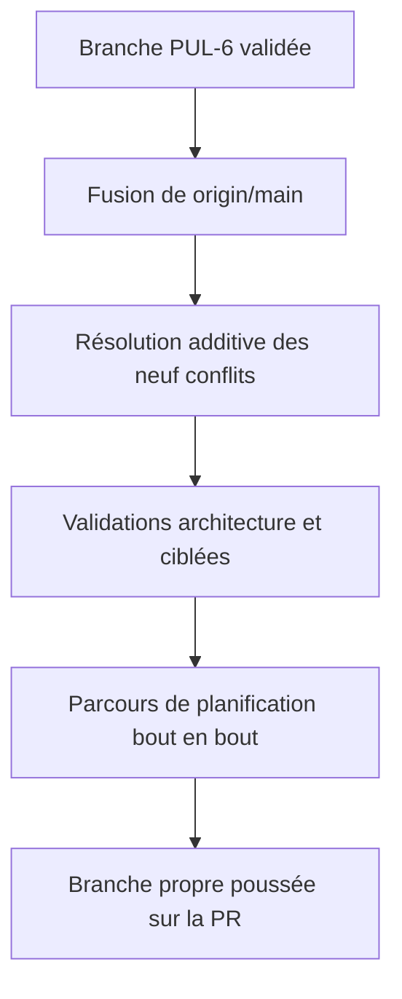
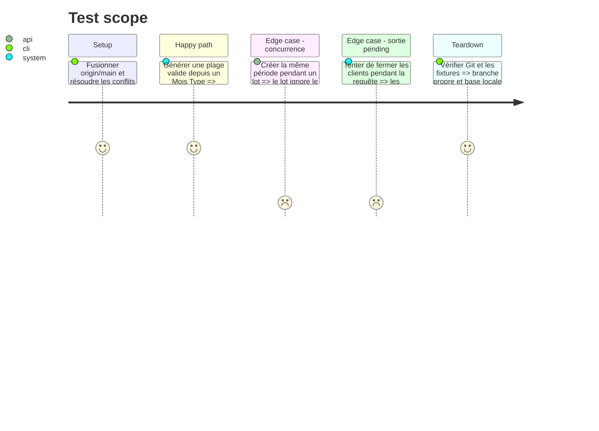

# Instruction: Réconcilier la branche avec main et valider

## Architecture projection

> Tree of the final files. ✅ create · ✏️ modify · ❌ delete

```txt
.
├── shared/schemas.ts                                      ✏️ conserve les contrats génération et feedback
├── backend-nest/src/types/database.types.ts               ✏️ réunit les RPC budget et la table feedback générée
├── frontend/projects/webapp/public/i18n/
│   ├── de.json                                            ✏️ conserve les catalogues planification et feedback
│   ├── en.json                                            ✏️ conserve les catalogues planification et feedback
│   ├── fr.json                                            ✏️ conserve les catalogues planification et feedback
│   └── it.json                                            ✏️ conserve les catalogues planification et feedback
└── ios/Pulpe/
    ├── App/PulpeApp.swift                                 ✏️ conserve les deux routages de harness
    ├── Core/Network/Endpoints.swift                       ✏️ conserve les endpoints budgets et feedback
    └── Resources/Localizable.xcstrings                    ✏️ fusionne les chaînes des deux fonctionnalités
```

## User Journey



## Test Scope



## Tasks to do

### `1)` Fusionner main sans régression

> Chaque conflit est additif: conserver PUL-6 et les fonctionnalités déjà livrées sur main.

1. Fusionner `origin/main` dans la branche publiée sans réécrire son historique.
2. Résoudre les neuf fichiers en conservant les deux contrats puis contrôler les JSON et le catalogue de chaînes.
3. Régénérer les artefacts uniquement si le merge rend les sorties générées incohérentes.

### `2)` Valider le candidat complet

> Les contrôles ciblés précèdent le parcours de bout en bout obligatoire.

1. Exécuter les assertions d'architecture et les suites ciblées Backend, Web, Android et iOS.
2. Exécuter en dernier le parcours de planification bout en bout disponible dans le dépôt.
3. Committer et pousser uniquement un candidat propre et vert.

## Test acceptance criteria

| Task | Acceptance criteria |
| ---- | ------------------- |
| 1 | La branche contient `origin/main` sans marqueur de conflit et conserve les contrats PUL-6 et feedback dans chaque fichier partagé. |
| 2 | Les suites ciblées des quatre plateformes et le parcours de planification bout en bout passent; la branche poussée est propre. |
