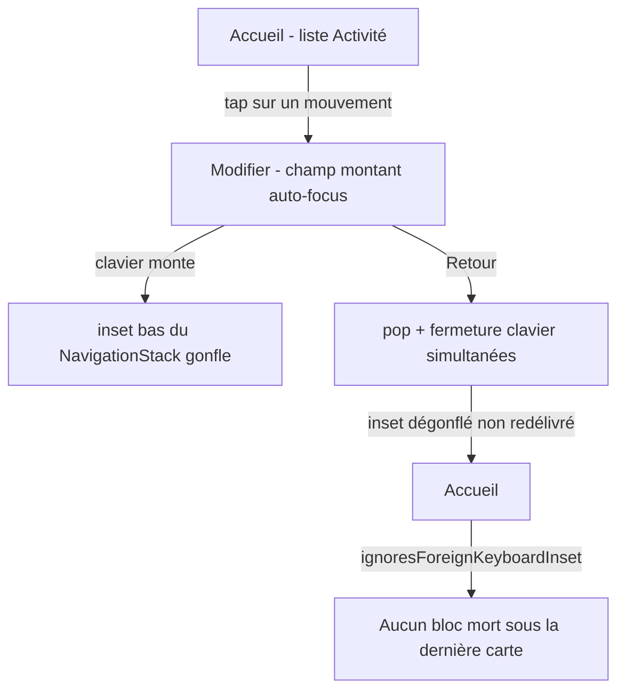
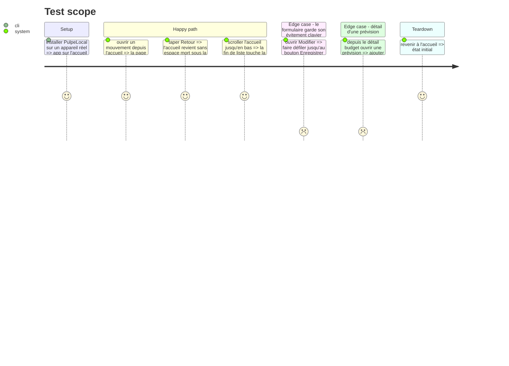

# Instruction: nommer le remède et l'appliquer aux points de composition

## Architecture projection

```txt
.
└── ios/Pulpe/
    ├── Shared/Extensions/
    │   └── View+Extensions.swift              ✏️ ajoute `ignoresForeignKeyboardInset()`, retire `avoidsKeyboard`
    ├── App/
    │   └── MainTabView.swift                  ✏️ 4 racines + `budgetDestination` + `savingsGoalDestination` extrait
    └── Features/Budgets/BudgetDetails/
        ├── BudgetDetailsView.swift            ✏️ retire le reset inline et son commentaire (−8 lignes sous le plafond 350)
        ├── BudgetDetailsView+Routing.swift    ✏️ reset sur `.lineDetail`
        └── BudgetLineDetailPage.swift         ✏️ `avoidsKeyboard: false` devient inutile
```

## User Journey



## Test Scope



## Tasks to do

### `1)` Nommer le remède dans `View+Extensions.swift`

> Une seule orthographe, une seule explication, pour toute l'app.

1. Ajouter `func ignoresForeignKeyboardInset() -> some View` qui applique `.ignoresSafeArea(.keyboard, edges: .bottom)`.
2. Documenter en un seul endroit : deux écrans d'un même `NavigationStack` partagent son inset clavier ; à la fermeture du clavier pendant un pop, l'inset dégonflé n'est pas redélivré à l'écran redevenu visible. Le modificateur refuse un inset qui n'appartient pas à l'écran.
3. Dire la condition d'emploi : réservé aux écrans **sans champ de saisie inline** ; les feuilles ne comptent pas, elles sont des hôtes de présentation séparés.
4. Dire pourquoi il s'applique depuis le site d'appel : il enveloppe la chaîne complète, donc les overlays en héritent par construction (le faux correctif de PUL-284 devient impossible).

### `2)` Appliquer aux racines et destinations dans `MainTabView.swift`

> L'inventaire des écrans de navigation devient lisible en un seul fichier.

1. Poser `ignoresForeignKeyboardInset()` sur les quatre racines : `CurrentMonthView`, `SavingsGoalsListView`, `BudgetListView`, `TemplateListView`.
2. Dans `budgetDestination(_:)`, poser le modificateur sur `.details` ; laisser `.editTransaction` nu — il possède le champ.
3. Extraire `savingsGoalDestination(_:service:)` sur le modèle de `budgetDestination(_:)`, remplacer les trois `switch` recopiés dans les onglets, y poser le modificateur.
4. Poser le modificateur sur `TemplateDetailsView` dans `TemplatesTab`.

### `3)` Retirer les deux orthographes rivales

> Un seul mécanisme, sinon la prochaine surface en réinventera un troisième.

1. Supprimer de `BudgetDetailsView.swift` le `.ignoresSafeArea(.keyboard, edges: .bottom)` final et son commentaire de huit lignes — le site d'appel le porte désormais.
2. Supprimer le paramètre `avoidsKeyboard` de `pulpeStickyBottomCTA` et le `.ignoresSafeArea` conditionnel de `PulpeStickyBottomCTAModifier`.
3. Retirer l'argument `avoidsKeyboard: false` de `BudgetLineDetailPage.swift:97`, seul appelant non par défaut.

### `4)` Vérifier

1. `xcodegen generate --use-cache` puis `xcodebuild build -scheme PulpeLocal -configuration Local`.
2. `swiftlint --strict` — vérifier que `BudgetDetailsView.swift` reste sous 350 lignes et `MainTabView.swift` sous 500.
3. `xcodebuild test -scheme PulpeLocal -only-testing:PulpeTests`.
4. Reproduire le parcours du Test Scope sur appareil réel : le simulateur ne rejoue pas fidèlement le timing de dismissal.

## Test acceptance criteria

| Task | Acceptance criteria                                                                                                              |
| ---- | -------------------------------------------------------------------------------------------------------------------------------- |
| 1    | `ignoresForeignKeyboardInset()` existe, porte l'unique explication du mécanisme et la condition d'emploi                          |
| 2    | Les onze écrans de navigation sont soit marqués du modificateur, soit l'un des deux qui possèdent un champ ; `SavingsGoalDestination` n'est plus recopié |
| 3    | `grep -rn "ignoresSafeArea(.keyboard" ios/Pulpe/` ne renvoie que la définition du modificateur ; `avoidsKeyboard` n'existe plus   |
| 4    | Retour depuis « Modifier » : l'accueil n'a aucun espace mort ; le bouton Enregistrer reste au-dessus du clavier dans le formulaire |
