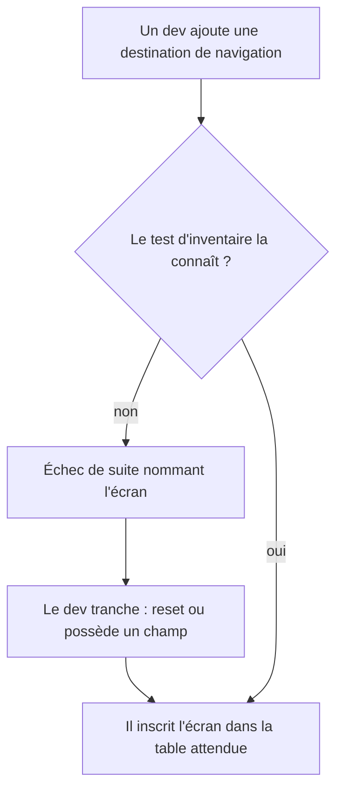
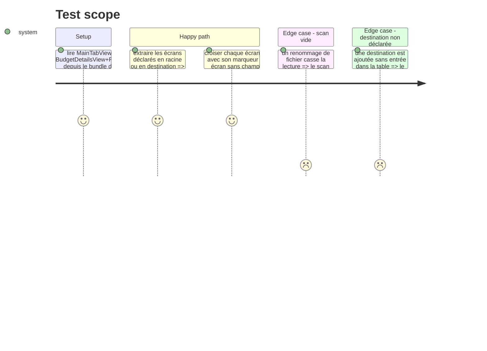

# Instruction: verrouiller l'inventaire des écrans de navigation

## Architecture projection

```txt
.
└── ios/PulpeTests/App/
    └── NavigationKeyboardInsetTests.swift     ✅ le test d'inventaire
```

## User Journey



## Test Scope



## Tasks to do

### `1)` Écrire `NavigationKeyboardInsetTests`

> Rendre l'oubli bruyant à la compilation de la suite, pas silencieux en production.

1. Lire les deux fichiers de composition depuis le dépôt (chemin dérivé de `#filePath`, comme les tests d'architecture existants du dossier BudgetDetails).
2. Extraire les écrans construits en racine de `NavigationStack` et dans les closures de destination.
3. Comparer à une table attendue explicite : chaque écran est `resets` ou `ownsAField`, `EditTransactionPage`, `EditTransactionHost` et `AddAllocatedTransactionPage` étant les seuls `ownsAField`.
4. Vérifier que chaque écran `resets` est bien suivi de `ignoresForeignKeyboardInset()`.

### `2)` Protéger le test contre le faux vert

> Un détecteur qui ne scanne rien passe au vert ; c'est le piège documenté des détecteurs sans parseur Swift.

1. Affirmer que les sources lues sont non vides avant toute autre assertion.
2. Affirmer que l'inventaire extrait compte au moins autant d'écrans que la table attendue.
3. Écrire dans la doc du test que la lecture est textuelle, donc qu'un renommage de fichier doit casser le test plutôt que le vider.

### `3)` Vérifier

1. `xcodebuild test -scheme PulpeLocal -only-testing:PulpeTests`.
2. Retirer temporairement un `ignoresForeignKeyboardInset()` et confirmer que la suite passe au rouge en nommant l'écran.
3. `swiftlint --strict`.

## Test acceptance criteria

| Task | Acceptance criteria                                                                                              |
| ---- | ------------------------------------------------------------------------------------------------------------------ |
| 1    | La suite échoue quand une destination est ajoutée sans entrée dans la table attendue, et le message nomme l'écran   |
| 2    | La suite échoue quand la lecture de source renvoie zéro écran, au lieu de passer silencieusement                    |
| 3    | Retirer un `ignoresForeignKeyboardInset()` d'une racine rend la suite rouge ; la remettre la rend verte             |
