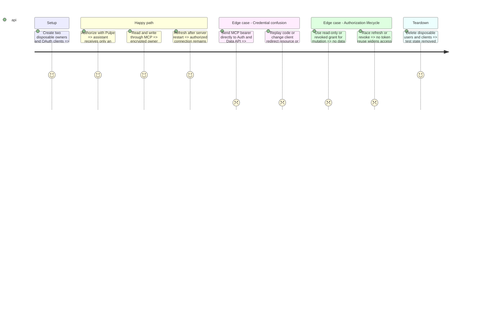

# Instruction: Separate MCP credentials from Supabase sessions

## Architecture projection

```txt
backend-nest/
  src/main.ts                                             ✏️ mount the SDK OAuth router
  src/config/environment.ts                               ✏️ validate issuer/upstream configuration
  src/modules/mcp/mcp.module.ts                            ✏️ wire the provider without new generic abstractions
  src/modules/mcp/infrastructure/oauth/
    mcp-oauth.provider.ts                                  ✅ SDK provider with isolated credentials
    supabase-oauth-authorization.adapter.ts                ✏️ retain consent port, stop direct upstream redirects
  src/modules/mcp/infrastructure/persistence/
    supabase-mcp-oauth.repository.ts                       ✅ durable single-use codes and rotated token hashes
    supabase-mcp-connection.repository.ts                  ✏️ bind internal upstream credentials to a connection
  src/modules/mcp/infrastructure/auth/mcp-token.guard.ts    ✏️ accept MCP-only credentials, preserve request context
  src/modules/mcp/infrastructure/http/
    protected-resource-metadata.controller.ts              ✏️ advertise the isolated issuer
  src/modules/mcp/infrastructure/oauth/mcp-oauth.spec.ts    ✅ boundary and lifecycle checks
  src/types/database.types.ts                             ✏️ regenerate from isolated schema
  supabase/config.toml                                    ✏️ disable upstream public registration
  supabase/migrations/                                    ✅ CLI-generated isolation migration
  .env.example                                            ✏️ document required non-secret configuration
```

## Test Scope



## Tasks to do

### `1)` Prove the credential exchange before replacing the flow

1. Obtain user approval for the architectural change exceeding 300 lines.
2. In the isolated stack, prove a confidential upstream session can serve existing `auth.getUser()` and owner-RLS callers without exposing its access or refresh token downstream.
3. Close public upstream registration and reject any consent route that bypasses the MCP issuer. Do not change shared local or production settings during this proof.

### `2)` Implement the smallest persistent SDK provider

1. Reuse SDK PKCE, registration validation, OAuth errors and rate limiting; bind code, client, exact redirect, resource, owner and chosen mode.
2. Hash random external credentials; expire/consume authorization codes atomically; rotate refresh tokens with replay protection. Encrypt internal upstream credentials with a purpose-separated server wrapping key.
3. Preserve the consent API and clear data-sharing copy. Destroy internal credentials on revoke, PIN recovery/change and account deletion; reject old direct Supabase bearers on MCP.
4. Preserve encrypted repositories and user RLS. Test ordinary first-party sessions and wrong-user access alongside MCP; do not mint privileged user-data tokens.

## Test acceptance criteria

| Task | Acceptance criteria                                                                                                                                    |
| ---- | ------------------------------------------------------------------------------------------------------------------------------------------------------ |
| 1    | No external client can obtain the internal Supabase bearer through registration, consent, callback, token response or errors.                          |
| 2    | A valid MCP bearer succeeds only on its authorized tools; direct Auth/table/RPC/GraphQL requests fail, and normal Pulpe sessions still work.           |
| 2    | Replays, wrong client/resource, read-only writes and revoked access cannot mutate data; internal credentials never appear in logs or public responses. |
