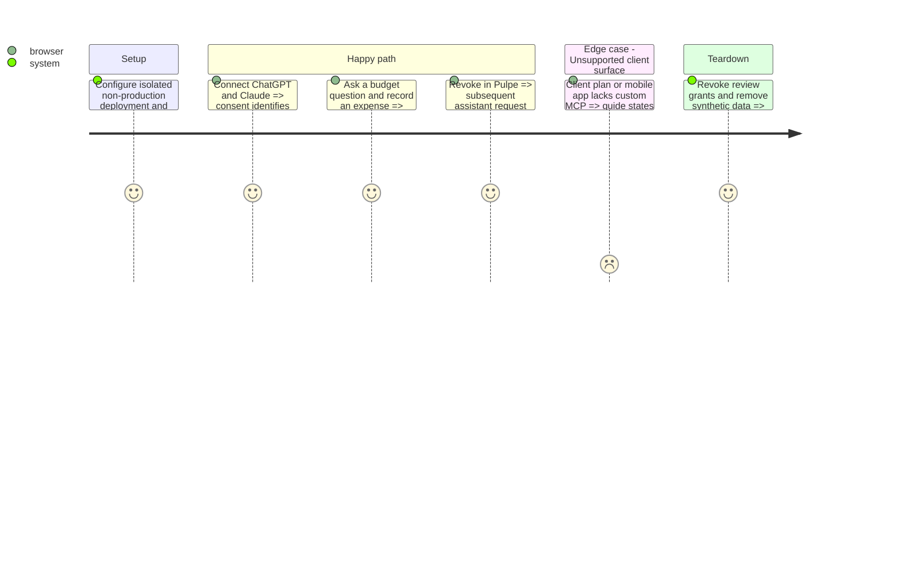

# Instruction: Verify useful client flows and prepare activation

## Execution checkpoint — 2026-09-06

Server verification passed: all 15 tools execute through real HTTP and encrypted owner data, within 18 MCP scenarios and 121 passing backend integration/e2e tests. Account-currency edits, destructive annotations and literal search were corrected. Existing CI already runs this test file. Client requirements, evaluation prompts and current evidence are recorded in the linked readiness documents.

The dedicated `pulpe-mcp-test` Supabase project in `Pulpe Tests` is healthy on Free with 102 migrations, closed public signup and a configured confidential OAuth upstream. The separate Vercel test site is READY and publicly accessible with verified test-only configuration, disabled analytics and a no-index header. After explicit approval, Railway configuration was applied and verified; deployment `a891edbf-e357-4f6d-bad5-e2cd1239f28a` reached `SUCCESS`. The [plan checkpoint](./plan.md#execution-checkpoint--2026-09-06) records exact resources and local secret storage.

The synthetic account and encrypted budget are ready. Remote HTTP authorization, 15-tool discovery, read/write concordance, direct Supabase denial, refresh and revocation passed; the probe movement was removed. Following user approval, both legacy vendor connectors were replaced. Claude Pro web completed consent, seven-tool read-only discovery, a correct budget read and an unavailable-write check; the refreshed Pulpe dashboard remained unchanged. The currency and expense-label presentation gaps are now corrected in source, with 19 isolated HTTP scenarios passing; deployed vendor wording still requires verification. ChatGPT's new app was created but OAuth stalled before consent. Automatic security review then rejected disconnecting the Claude test grant before read/write testing; no workaround was attempted and its read-only grant remains active. Phase 2 is blocked on that exact access-change authorization, with actual vendor write/revocation and desktop/mobile acceptance still incomplete.

## Architecture projection

```txt
backend-nest/src/modules/mcp/                              ✏️ focused HTTP integration checks using existing test conventions
.github/workflows/ci.yml                                 ✏️ run the isolated credential boundary check
aidd_docs/tasks/2026_08/2026_08_23_pulpe-mcp-agent-connector/
  verification-2026-09-05.md                             ✏️ replace unresolved claims with current evidence
  submission-checklist.md                               ✏️ current directory requirements and activation prerequisites
landing/content/dictionaries/                           ✏️ only claims proven by actual client support
```

## Test Scope



## Tasks to do

### `1)` Verify the complete connector

1. Run all 15 tools against synthetic encrypted data and compare budgets, movements and savings metrics with Pulpe, including missing-input behavior and destructive-action annotations.
2. Verify consent, login return, refresh, reconnection, wrong PIN, read-only mode, revocation and key rotation over HTTP. Exercise direct Auth, tables, invoker/definer RPCs and GraphQL with the external bearer.
3. Run backend checks, SQL contracts, generated-type comparison, Angular production build, targeted web tests and native connection-management tests. Preserve frontend/landing disclosure and four-language rendering checks.

### `2)` Validate clients and prepare the release handoff

1. Use non-production credentials and synthetic data for real ChatGPT and Claude OAuth/tool round trips. Record client, account plan, surface and observable result, not just discovery responses.
2. Verify each requested web/desktop/mobile surface against actual availability. Prepare directory submission requirements where custom connectors cannot satisfy that surface; never promise a vendor capability not available.
3. Prepare exact issuer URLs, secrets names, migrations and activation order. Production changes, directory agreements and account-sensitive submissions require explicit human authorization; keep the public landing in preparation until readiness is proven.

## Test acceptance criteria

| Task | Acceptance criteria                                                                                                                                     |
| ---- | ------------------------------------------------------------------------------------------------------------------------------------------------------- |
| 1    | Financial outputs match Pulpe, authorized writes persist encrypted, and every forbidden direct or MCP access leaves data unchanged.                     |
| 1    | Existing web/native users keep their connection-management and ordinary authentication behavior.                                                        |
| 2    | Each supported client completes association, useful read/write and revocation; unsupported surfaces and submission prerequisites are stated accurately. |
| 2    | Activation can follow verified configuration and migration evidence without exposing unrestricted Supabase credentials.                                 |
