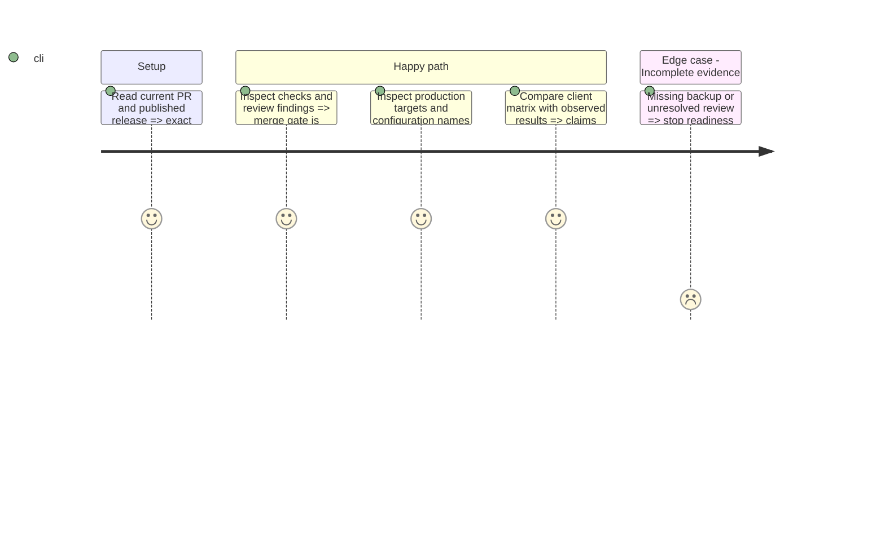

# Instruction: Close readiness gaps and collect the launch decisions

## Architecture projection

```txt
aidd_docs/tasks/
  2026_09/2026_09_05_mcp-credential-isolation/cutover.md       ✏️ current readiness evidence and owner decisions
  2026_08/2026_08_23_pulpe-mcp-agent-connector/
    submission-checklist.md                                ✏️ exact client acceptance and remaining distribution gates
```

No runtime file, dependency, workflow or infrastructure resource is created or deleted by this phase. Existing tests and provider APIs supply the evidence.

Completed 2026-09-08: the merged feature gate, scoped tests, provider observations
and owner decision packet are recorded in the cutover runbook. This completes
evidence collection and handoff, not production approval: legacy history,
account results and the exact release/activation decisions remain explicit gates.

## Test Scope



## Tasks to do

### `1)` Close the feature gate

1. Read the exact PR SHA, check runs and unresolved threads. Investigate the Claude execution failure without enabling raw sensitive output; do not rerun an old unsafe Android workflow. Require green mandatory CI and a completed review of any new findings before the already-authorized feature merge; do not substitute a prior SHA's success.
2. Reuse `pnpm test:release-state`, `pnpm test:workflow-proof`, `pnpm test:migration-contract` and `pnpm test:ci-security`. Their negative cases must still reject duplicate dispatches, drift, expired proofs and unsafe credential publication.
3. Recheck the exact candidate dependency audit beyond the critical-only CI threshold, MCP HTTP boundary suite, SQL/types, web build/CSP and consent regressions. Record test scope, skips and evidence links. Do not recreate retired test projects merely to repeat their historical evidence.

### `2)` Assemble the launch packet in the cutover runbook

1. Resolve current Supabase, Railway and Vercel production targets read-only; verify secret **names**, production OAuth/DCR state, redirect allowlists and backup/restore availability. Record timestamps and IDs, never secret values. Give the owner normal login, refresh and encrypted-budget checks for his own account; record them as pending until he reports results. Repeat that owner baseline after the disabled deployment, before activation; the agent does not sign in to the personal account.
2. Record the complete pending migration set from the latest published anchor and remote migration history. The present candidate has five files, including orphan-client retention; never assume this count remains fixed.
3. Establish whether any legacy native MCP credentials were issued. Unknown history blocks activation; follow cutover section 1 rather than inferring safety from an empty connection table. Never reset the linked database or rotate global signing/encryption keys.
4. Present one decision packet: actual provider IDs; settings delta; exact version/FR-EN-DE-IT approval at phase 2; backup and window; owner-led functional checklist (read-only, separately consented read/write, one 1 CHF test expense, cleanup and revocation); separately approved synthetic scope for credential-boundary probes; public OAuth exposure; and recovery permission. Do not reuse the permanent Maestro account or its renewed credentials for MCP acceptance. Packet completion is not production readiness sign-off while an operation gate remains unresolved.
5. Preserve mobile testing as an owner waiver, not a verified result. State desktop-write, Claude Code and ChatGPT read-only limitations from the matrix. Directory reviewer access, legal attestations and publication remain separate decisions.

## Test acceptance criteria

| Task | Acceptance criteria                                                                                                                                             |
| ---- | --------------------------------------------------------------------------------------------------------------------------------------------------------------- |
| 1    | The current feature SHA is merged only after its applicable CI and review gates pass; failed infrastructure execution is not described as approval.             |
| 1    | Existing promotion contracts reject stale or ambiguous release evidence without mutation.                                                                       |
| 2    | The owner can review exact targets, changes, account scope, safeguards and remaining decisions in one place; no secret or personal financial data is published. |
| 2    | Unknown legacy issuance, unavailable backups or an unapproved operation visibly prevents readiness sign-off.                                                    |
