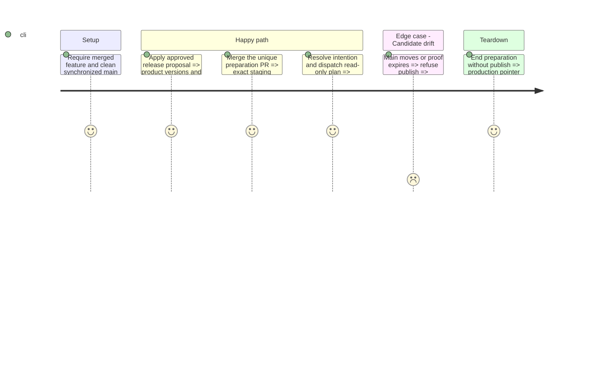

# Instruction: Prepare an exact, approved release candidate

## Architecture projection

```txt
package.json                                                ✏️ approved product version
{frontend,landing,backend-nest,shared,android}/package.json    ✏️ Changesets fixed versions
{frontend,landing,backend-nest,shared,android}/CHANGELOG.md    ✏️ native generated changelogs
android/app.json                                            ✏️ matching product version
.changeset/                                                 ✏️ one native changeset, consumed by versioning
pnpm-lock.yaml                                              ✏️ only native versioning changes if produced
landing/data/releases.json                                  ✏️ approved four-language release notes
frontend/projects/webapp/src/app/layout/whats-new/
  whats-new-releases.ts                                     ✏️ explicit web toast or silent outcome
ios/project.yml                                             ✏️ only the approved native version/build decision
backend-nest/src/modules/whats-new/domain/releases-data.ts    ✏️ only the applicable iOS projection or explicit silence
aidd_docs/tasks/2026_09/2026_09_05_mcp-credential-isolation/
  cutover.md                                                ✏️ preparation PR and immutable manifest references
```

Braces enumerate existing package files, not new abstractions. No release script is added. The evidence update belongs in a separate normal documentation PR after publication: never add a second commit to the mechanical release branch or move `main` after its preparation merge.

## Test Scope



## Tasks to do

### `1)` Prepare the release through the existing release skill

1. Start only from a clean synchronized `main` worktree after phase 1. Preserve this feature worktree and any unrelated changes; do not detach or reset another worktree. Check published lineage, required workflows and credential names before release-file edits.
   For the approved recovery of #727, first complete phase 1b and require successful Android E2E as well as mandatory CI on the corrective PR. Preserve commit `2e4aefb3883f4b9296230ef43fe7473bbafba94a`, close #727 without merging, then remove and recreate only `release/v0.49.0` from synchronized `main`. Never force-push or edit the old PR body. Reuse the approved copy, with separate mobile projections, and validate the replacement before publication.
2. Follow `.agents/skills/release/SKILL.md`: derive version and native impact from the complete unpublished diff, present FR/EN/DE/IT notes, then obtain exact version/copy approval. Do not guess a future version from today's `0.48.0` baseline.
3. Apply one lockstep bump and the approved native decision, then run the existing What's New parity/locale validator and quality checks. Native Pulpe distribution is not a prerequisite for deploying the MCP server; the complete release scope still governs versioning and native CI.
4. Obtain the skill's separate approval to push the validated release branch/PR. Use one mechanical release commit and an immutable preparation-PR body. Merge with the owner merge commit only after checks pass; keep `main` at that exact candidate.

### `2)` Bind the launch to the proven manifest

1. Require the exact successful staging proof, not a provider's generic latest success. Use `resolve-release-state.mjs` before each dispatch; existing active/successful runs are resumed, never duplicated. A retry needs the diagnosed latest terminal intention and current workflow, not a blind rerun.
2. Dispatch only `release-promotion.yml` mode `plan` from `main`. Inspect its version, candidate, rollback anchor, complete migration set and deployment IDs against phase 1. Keep the immutable artifact URL in the task until it can be recorded without moving the frozen candidate.
3. Present the final launch packet for approval, including disabled deployment, owner-led account/assistant checks, explicitly approved public activation and separately scoped synthetic credential-boundary verification. Production environment approval remains a real GitHub gate, not an agent-managed bypass.

## Test acceptance criteria

| Task | Acceptance criteria                                                                                                                    |
| ---- | -------------------------------------------------------------------------------------------------------------------------------------- |
| 1    | All product versions agree, approved visible notes exist in four languages and one owner-merged preparation PR identifies the release. |
| 2    | The launch names an existing immutable manifest whose SHA is still the tip of main and whose exact staging proof is valid.             |
| 2    | Repeating the same preparation intention does not create another run, PR, tag or release; production is still unchanged.               |
