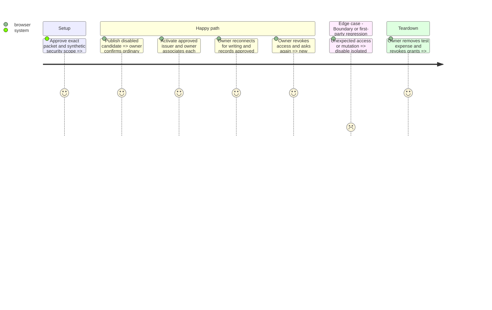

# Instruction: Deploy, activate and verify the approved MCP

## Architecture projection

```txt
aidd_docs/tasks/2026_09/2026_09_05_mcp-credential-isolation/
  cutover.md                                              ✏️ sanitized production and recovery evidence
aidd_docs/tasks/2026_08/2026_08_23_pulpe-mcp-agent-connector/
  submission-checklist.md                                ✏️ actual production acceptance and listing state
landing/content/dictionaries/{fr,en,de,it}.ts              ✏️ availability copy only after the matching launch gate
backend-nest/.mcp-production/.env.local                     ✅ only when a fresh production secret is needed; ignored, protected, never committed
```

Reuse `landing/public/icon.png`; no icon redesign, UI layout change or custom deployment tool. Provider settings and listing drafts are external operations on the exact approved targets. Release evidence/copy changes use a later normal PR/release, never mutate the frozen candidate during promotion.

## Test Scope



## Tasks to do

### `1)` Publish the disabled deployment

1. Recheck phase 2's manifest and approvals immediately before writes. Follow cutover sections 1–3 on existing infrastructure. Preserve production first-party keys; create a distinct wrapping key only if absent, using the protected ignored Dashlane handoff. Stage settings without an unintended restart; keep both upstream credentials absent until activation.
2. Resolve the `publish` intention, dispatch the existing protected workflow and wait for the owner's GitHub production approval. Let its dry-run/apply perform **all** pending migrations with native `--include-all`; no manual SQL apply, reset, forced branch advance, ad-hoc deploy or premature tag.
3. Require exact provider deployments and `Production Finalized`, then check health/version, consent rendering and unavailable MCP. Ask the owner to confirm normal login/refresh/encrypted access before activation; no agent access to the personal account. Production credentials must never appear in browser configuration, assistant results, logs or evidence.

### `2)` Activate and prove useful, revocable access

1. After the legacy-retirement and public-exposure gates pass, configure the one confidential upstream client and both backend credentials together; native Supabase DCR stays disabled. Follow cutover section 3 for the same-source restart and verify every instance. This is public endpoint activation, not a tester allowlist.
2. Give the owner the production checklist from the cutover runbook. He associates ChatGPT and Claude through normal browser login/PIN, verifies the provider/data-sharing notice and read-only grant, then separately consents to read/write. He compares a useful read and one clearly marked 1 CHF expense with freshly loaded Pulpe, removes it and revokes both grants. Record his actual outcomes and surface/version, not private amounts, credentials or transcripts; leave unreported steps pending. Automated catalog/security evidence does not substitute for this deployed functional acceptance.
3. Reuse credential-boundary checks with synthetic credentials only: external MCP bearer rejected by Supabase Auth/Data API, revoked bearer/refresh refused, unrelated first-party access preserved. Never run a broad fixture-seeding or destructive test script against production. Record sanitized outcomes, client versions and deployment IDs, not raw transcripts or tokens.
4. Propose a 15-minute observation window for owner approval; watch existing health, OAuth/MCP failures, latency and activity without new monitoring infrastructure. Any boundary violation, unexplained write or first-party regression triggers cutover section 4: disable both upstream variables, verify denial, preserve keys and financial data. Revoke affected grants when permanent retirement is required; disabling alone is not revocation. No automatic database restore or legacy-issuer rollback.

### `3)` Finish branding and distribution without false availability claims

1. Prepare the existing logo, support/privacy/terms URLs and evaluation cases from the submission checklist. Verify logo rendering in actual production listing/association surfaces when the portal supports it; `plugin.json` does not control the ChatGPT icon.
2. After owner identity/legal/submission approval, use each official portal. Keep directory reviewer fixtures separate from short-lived smoke data; retain only the approved reviewer account for the review period. Vendor review is asynchronous and is not guaranteed by successful custom-connector tests.
3. Update four-language landing/guide availability through the normal release process only to match verified production access and directory status. Keep mobile/other unverified surfaces qualified. Do not delay an authorized custom-connector rollout merely because directory review is pending, and never call it universal availability.
4. Provide the owner with production/listing URLs, checks, any remaining vendor decision and protected Dashlane file link. Remove local secret copies only after backup confirmation; complete cleanup of review fixtures only after their review purpose ends.

## Test acceptance criteria

| Task | Acceptance criteria                                                                                                                               |
| ---- | ------------------------------------------------------------------------------------------------------------------------------------------------- |
| 1    | The approved exact source is finalized in production; encrypted ordinary account access works before public MCP activation.                       |
| 2    | Each claimed client completes scoped consent, useful read/write, cleanup and revocation; external credentials cannot access native Supabase APIs. |
| 2    | An incident leaves MCP unavailable without restoring the old issuer, losing financial data or replacing first-party keys.                         |
| 3    | The icon, disclosure and four-language guide match actual availability; vendor approval and untested surfaces are never presented as passed.      |
