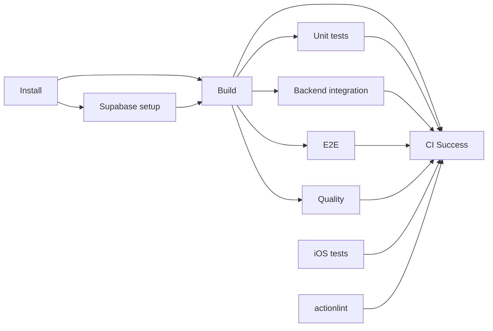

# Continuous Integration

`.github/workflows/ci.yml` is the executable source of truth. It runs once for pull
requests targeting `preview`, with one active run per ref. Pushes and production PRs
reuse immutable evidence instead of rebuilding the same tree.

Security-sensitive workflow contracts are explicit: `pull-requests: write`,
`NODE_VERSION: "24"`, and CLI Supabase 2.113.0.

## Required jobs


```mermaid
flowchart LR
    Install[Install] --> Supabase[Supabase setup]
    Install --> Build[Build]
    Supabase --> Build
    Build --> Unit[Unit tests]
    Build --> Integration[Backend integration]
    Build --> E2E[E2E]
    Build --> Quality[Quality]
    Build --> Success[CI Success]
    Unit --> Success[CI Success]
    Integration --> Success
    E2E --> Success
    Quality --> Success
    IOS[iOS tests] --> Success
    Actionlint[actionlint] --> Success
```

- `install` installs the frozen pnpm workspace.
- `supabase-setup` starts local Supabase once and uploads its state for dependent jobs.
- `build` builds the pnpm packages and uploads artifacts.
- `test-unit` runs workspace unit tests.
- `test-backend-integration` runs Bun integration and E2E specs against local Supabase.
- `test-e2e` runs the Playwright matrix.
- `quality` runs the root quality gate, including repository security and vocabulary tests.
- `actionlint` validates workflow syntax and shell fragments.
- `test-ios` generates the Xcode project and runs Swift tests on macOS.
- `ci-success` is the single protected status and fails unless every required job succeeded.

There is no performance-test job: the former job selected a deleted test file, so Bun ran
zero tests while reporting success.

## Release proofs

The release path reuses the complete CI result from the App-authored preparation PR
instead of treating a second build as the identity of the candidate:


```mermaid
flowchart LR
    PR["release/vX.Y.Z → preview"] --> CI["Complete PR CI"]
    CI --> Merge["Merge commit P on preview"]
    Merge --> Deploy["Vercel and Railway preview"]
    Deploy --> Proof["Staging Ready from Railway deployment_status"]
    Proof --> Gate["release/vX.Y.Z → main · Release Gate"]
    Gate --> Human["Human approval"]
    Human --> Production["Production deployments, proof and publication"]
```

`Staging Ready` is triggered by Railway's successful preview `deployment_status`.
The proof compares the tested and merged Git trees, requires exact provider SHAs, and
runs staging health checks. A release additionally proves that the release commit and
the merge commit share the same original `preview` base; a feature merged during the
short release freeze therefore stops promotion. Normal preview PRs produce a proof but
are not promoted.

## Quality boundary

```bash
pnpm quality
```

This runs package quality tasks through Turbo, checks automation formatting, and executes the
CI security, public-surface, and product-lexicon tests. Angular templates are compiled by the
build job; `tsc` alone does not validate them.

Lefthook runs a change-scoped variant before ordinary commits and skips it during merge and
rebase. CI always runs the complete gate.

## Migrations and production

`production.yml` authenticates the App-authored and approved release PR before checking
out repository code. It detects migration changes against the previous `main`; only a
release containing migrations enters the protected `production` environment for dry-run
and apply. After exact provider deployments, the same workflow verifies CSP, records the
production proof, publishes the tag/Release, annotates PostHog and updates the web gate.

## Local equivalents

```bash
pnpm build
pnpm test
pnpm test:e2e
pnpm quality

cd backend-nest
bun run test:integration
```

Run Supabase commands from `backend-nest/`. Versions used by CI are pinned near the top of the
workflow and in the workspace lockfile.
