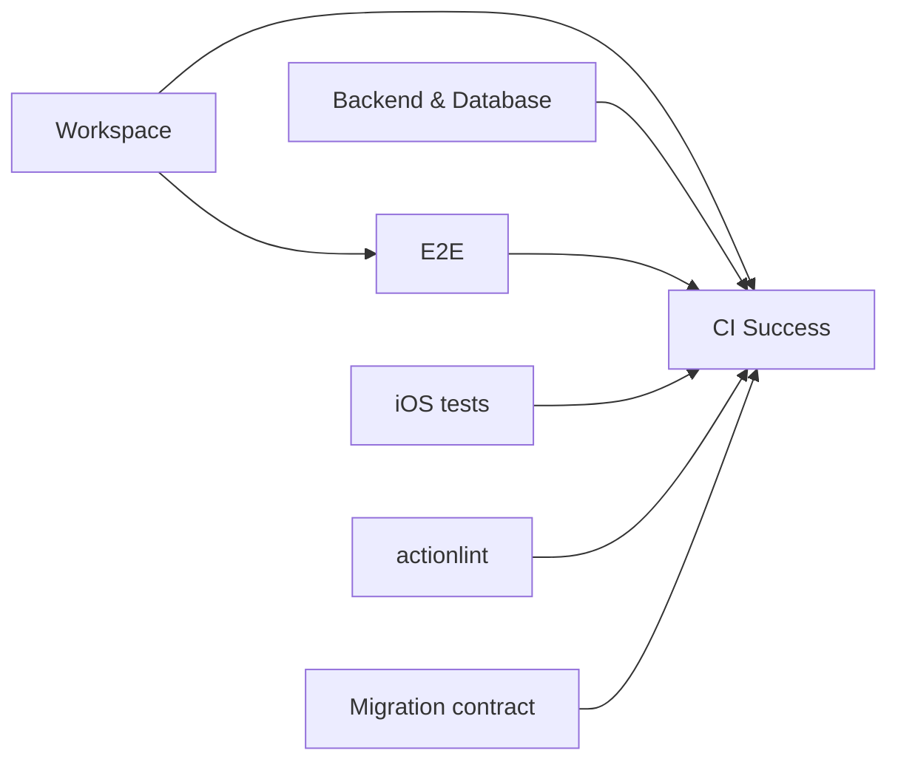

# Continuous Integration

`.github/workflows/ci.yml` is the executable source of truth. It runs once for pull
requests targeting `preview`, with one active run per ref. Pushes and production PRs
reuse immutable evidence instead of rebuilding the same tree.

Security-sensitive workflow contracts are explicit: a read-only token
(`contents: read` is the only workflow permission), `NODE_VERSION: "24"`, and
CLI Supabase 2.113.0. E2E failures are diagnosed through the native Playwright
reporters — GitHub annotations, JUnit and blob — plus the report and
test-results artifacts uploaded on every outcome; no job writes checks or PR
comments.

## Required jobs


```mermaid
flowchart LR
    Workspace[Workspace] --> E2E[E2E]
    Workspace --> Success[CI Success]
    BackendDB[Backend & Database] --> Success
    E2E --> Success
    IOS[iOS tests] --> Success
    Actionlint[actionlint] --> Success
    Migration[Migration contract] --> Success
```

- `workspace` is the single Node unit: one checkout, one frozen pnpm install,
  then build, unit tests, lint, format, the root quality gate (repository
  security and vocabulary tests included), `deps:check` (Expo compatibility
  plus the frontend and Android circularity graphs) and the critical audit as
  separate steps sharing the local Turbo cache, before uploading the build
  artifacts E2E consumes. There is no separate install prewarm job: every job
  that needs Node declares its own install and pnpm cache.
- `backend-db` is the single database runner, parallel to `workspace`: it
  starts local Supabase exactly once, runs every SQL suite with
  `ON_ERROR_STOP`, verifies the committed TypeScript types, then runs the Bun
  integration and E2E specs against the same stack — no Supabase state
  artifact crosses runners. Stack images resolve from the GHCR mirror
  (`SUPABASE_INTERNAL_IMAGE_REGISTRY=ghcr.io`, exported by the
  setup-supabase-cli action) so Public ECR throttling stays off the critical
  path. `postgres-meta` only serves type generation, so both it and the types
  check run only when the PR touches the DB contract (migrations,
  `supabase/config.toml`, `database.types.ts`) — detection fails closed to
  checking. Types are generated into a temporary file and compared to the
  committed `database.types.ts`: a drift fails the job with a readable diff
  and the tracked file is never rewritten.
- `test-e2e` runs the two mocked Playwright projects (`Critical User Journeys`,
  `Feature Tests`) explicitly in one runner — Playwright parallelizes internally
  with a single checkout, pnpm install, Chromium and Angular `webServer`. One
  artifact set (report, JUnit, traces, screenshots, videos) is uploaded on
  every outcome; `Chromium - Smoke` never runs implicitly.
- `actionlint` validates workflow syntax and shell fragments.
- `test-ios` generates the Xcode project and runs Swift tests on macOS.
- `migration-contract` validates new migration metadata, additive SQL and immutable history.
- `ci-success` is the single protected status and fails unless every required job succeeded.

There is no performance-test job: the former job selected a deleted test file, so Bun ran
zero tests while reporting success.

## Release proofs

The release path reuses the complete CI result from the App-authored preparation PR
instead of treating a second build as the identity of the candidate:


```mermaid
flowchart LR
    PR["release/vX.Y.Z → preview"] --> CI["Complete PR CI"]
    CI --> Merge["Merge commit P on preview"]
    Merge --> Deploy["Vercel and Railway preview"]
    Deploy --> Proof["Staging Ready from Railway deployment_status"]
    Proof --> Gate["release/vX.Y.Z → main · Release Gate"]
    Gate --> Human["Human approval"]
    Human --> Production["Production deployments, proof and publication"]
```

`Staging Ready` is triggered by Railway's successful preview `deployment_status`.
When an authorized bypass merges a PR before its canonical CI finishes, the proof
waits on that exact run for at most 30 minutes and fails closed if the run fails,
its state is unknown, the API is unavailable, or `preview` moves.
The proof compares the tested and merged Git trees, requires exact provider SHAs, and
runs staging health checks. A release additionally proves that the release commit and
the merge commit share the same original `preview` base; a feature merged during the
short release freeze therefore stops promotion. Normal preview PRs produce a proof but
are not promoted.

## Quality boundary

```bash
pnpm quality
```

This runs package quality tasks through Turbo, checks automation formatting, and executes the
CI security, public-surface, and product-lexicon tests. Angular templates are compiled by the
build job; `tsc` alone does not validate them.

Lefthook runs a change-scoped variant before ordinary commits and skips it during merge and
rebase. CI always runs the complete gate.

## Migrations and production

`production.yml` authenticates the App-authored and approved release PR before checking
out repository code. It detects migration changes against the previous `main`; only a
release containing migrations enters the protected `production` environment for dry-run
and apply. The PR job checks its exact base/head range; production replays the exact
merge-parent/merge range before touching Supabase. Each new migration declares `expand`
or `contract` in its initial comment header, and published files cannot be changed.
After provider deployment, `production-finalize.yml` verifies the exact Railway and
Vercel deployments plus the public health and version endpoints, then publishes the
production proof, immutable tag and GitHub Release.

## Local equivalents

```bash
pnpm build
pnpm test
pnpm test:e2e
pnpm quality

cd backend-nest
bun run test:integration
```

Run Supabase commands from `backend-nest/`. Versions used by CI are pinned near the top of the
workflow and in the workspace lockfile.
