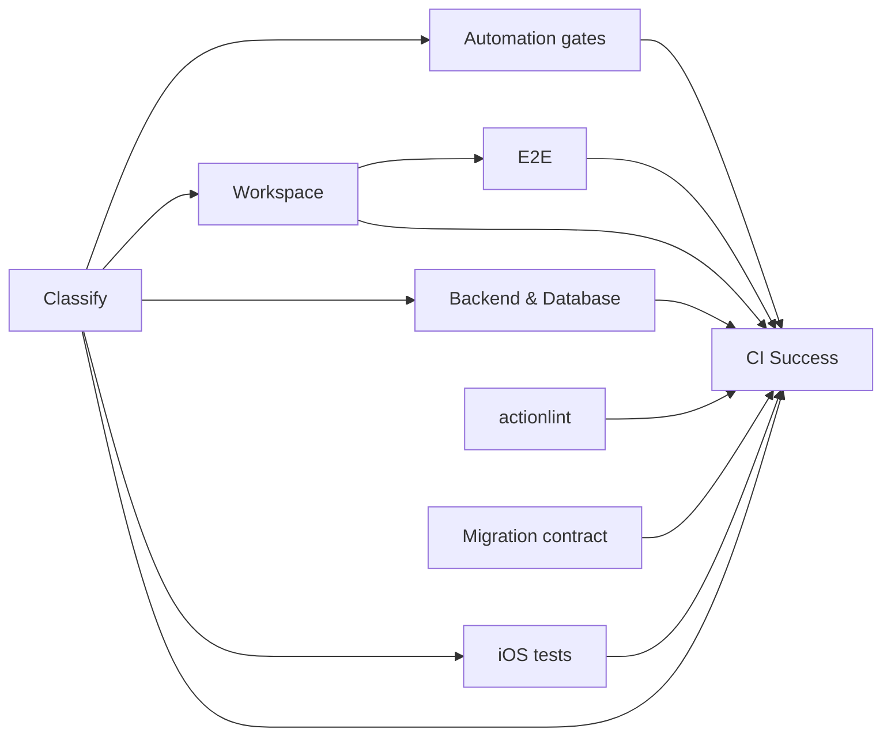

# Continuous Integration

`.github/workflows/ci.yml` is the executable source of truth. It runs once for pull
requests targeting `main`, with one active run per ref. There is no push trigger: the
staging proof and the release path reuse that immutable evidence instead of rebuilding
the same tree.

Security-sensitive workflow contracts are explicit: a read-only token
(`contents: read` is the only workflow permission), `NODE_VERSION: "24"`, and
CLI Supabase 2.113.0. E2E failures are diagnosed through the native Playwright
reporters — GitHub annotations, JUnit and blob — plus the report and
test-results artifacts uploaded on every outcome; no job writes checks or PR
comments.

## Required jobs


```mermaid
flowchart LR
    Classify[Classify] --> Automation[Automation gates]
    Classify --> Workspace[Workspace]
    Classify --> BackendDB[Backend & Database]
    Classify --> IOS[iOS tests]
    Workspace --> E2E[E2E]
    Classify --> Success[CI Success]
    Automation --> Success
    Workspace --> Success
    BackendDB --> Success
    E2E --> Success
    IOS --> Success
    Actionlint[actionlint] --> Success
    Migration[Migration contract] --> Success
```

### Routing

`classify` decides which units a PR must prove. The Git classifier owns only
the boundaries the package graph cannot see; files inside pnpm packages go
through `turbo query` so the existing graph stays the single source of
dependency truth. Any error, unknown surface, or ambiguity degrades to a full
run with its reason, and `✅ CI Success` accepts a skipped unit only when the
decision explicitly declares it not required — the decision is recorded in
`ci-evidence.json` under `routing`. `on.pull_request` keeps no `paths` filter,
so the required check exists (and can never hang Pending) on every PR.

| Change surface                                                                                           | Units that run                           |
| -------------------------------------------------------------------------------------------------------- | ---------------------------------------- |
| `.github/**` (static automation)                                                                         | Automation gates                         |
| `.github/actions/**`, `.github/scripts/start-supabase.sh` (executed inside runtime jobs)                 | Full run (all units)                     |
| `ios/**`                                                                                                 | Automation gates, iOS tests              |
| `frontend/**`                                                                                            | Workspace (affected), E2E                |
| `backend-nest/**`                                                                                        | Workspace (affected), Backend & Database |
| `landing/**`, `android/**`                                                                               | Workspace (affected)                     |
| `shared/**`, `ios/Pulpe/Domain/Formulas/**`, release branches, root contracts, self-edits, anything else | Full run (all units)                     |

`classify`, `actionlint` and `migration-contract` run on every PR. Self-edits
are `ci.yml`, the classifier and its test, and the CI security test; root
contracts are `package.json`, `pnpm-lock.yaml`, `pnpm-workspace.yaml`,
`turbo.json`, `.changeset/config.json` and `android/app.json`. When the
decision is routed, the workspace runs `build`, unit tests and `lint` with
`turbo --affected` against the PR base; full runs execute everything.

- `workspace` is the single Node unit: one checkout, one frozen pnpm install,
  then build, unit tests, lint, format, the root quality gate (repository
  security and vocabulary tests included), `deps:check` (Expo compatibility
  plus the frontend and Android circularity graphs) and the critical audit as
  separate steps sharing the local Turbo cache, before uploading the build
  artifacts E2E consumes. There is no separate install prewarm job: every job
  that needs Node declares its own install and pnpm cache.
- `backend-db` is the single database runner, parallel to `workspace`: it
  starts local Supabase exactly once, runs every SQL suite with
  `ON_ERROR_STOP`, verifies the committed TypeScript types, then runs the Bun
  integration and E2E specs against the same stack — no Supabase state
  artifact crosses runners. Stack images resolve from the GHCR mirror
  (`SUPABASE_INTERNAL_IMAGE_REGISTRY=ghcr.io`, exported by the
  setup-supabase-cli action) so Public ECR throttling stays off the critical
  path. `postgres-meta` only serves type generation, so both it and the types
  check run only when the PR touches the DB contract (migrations,
  `supabase/config.toml`, `database.types.ts`) — detection fails closed to
  checking. Types are generated into a temporary file and compared to the
  committed `database.types.ts`: a drift fails the job with a readable diff
  and the tracked file is never rewritten.
- `test-e2e` runs the two mocked Playwright projects (`Critical User Journeys`,
  `Feature Tests`) explicitly in one runner — Playwright parallelizes internally
  with a single checkout, pnpm install, Chromium and Angular `webServer`. One
  artifact set (report, JUnit, traces, screenshots, videos) is uploaded on
  every outcome; `Chromium - Smoke` never runs implicitly.
- `automation` runs the root gate that lives outside the packages
  (`pnpm quality:automation`: automation formatting plus the CI, release,
  routing, and lexicon invariant tests) when the workspace does not run — the
  workspace quality gate is a strict superset of it.
- `actionlint` validates workflow syntax and shell fragments. The pinned
  `1.7.12` predates GitHub's documented `queue: max` syntax, so CI suppresses
  only that exact parser diagnostic; every other actionlint and ShellCheck
  finding remains blocking.
- `test-ios` uses one macOS runner and one generated Xcode project. It first runs
  `xcodebuild test -scheme PulpeLocal` to compile the app and widget and execute
  the Swift tests, then reuses the simulator and DerivedData for the single targeted
  `BudgetOpensFromListUITests` smoke. Either proof failing or running zero tests fails
  the same job; there is no second iOS runner.
- `migration-contract` validates new migration metadata, additive SQL and immutable history.
- `ci-success` is the single protected status and fails unless every required
  job succeeded — a unit may be skipped only when the routing decision
  declares it not required.

There is no performance-test job: the former job selected a deleted test file, so Bun ran
zero tests while reporting success.

## Release automation

PR CI stays read-only and emits the tested-tree evidence used by staging. Native auto-merge is enabled only for the approved release PR. The main-push run sequences staging, production, GitHub publication and optional iOS submission with reusable workflows and `needs`. See [DEPLOYMENT.md](./DEPLOYMENT.md#release-process) for the canonical setup and stop-on-failure contract.

## Quality boundary

```bash
pnpm quality
```

This runs package quality tasks through Turbo, checks automation formatting, and executes the
CI security, public-surface, and product-lexicon tests. Angular templates are compiled by the
build job; `tsc` alone does not validate them.

Lefthook runs a change-scoped variant before ordinary commits and skips it during merge and
rebase. CI always runs the complete gate.

## Observed cutover measurements

The first comparable 2 h 30 window after the cutover (2026-08-29 21:00–23:30 UTC)
used only existing runs; no synthetic release or distribution was triggered.

| Measure                                    | Baseline | Observed                                      |
| ------------------------------------------ | -------: | --------------------------------------------- |
| Workflow runs in the window                |      129 | 75 (-41.9%); 50 were skipped                  |
| Jobs in a successful complete CI           |       16 | 10 (-37.5%)                                   |
| pnpm installs per successful complete CI   |       11 | 5 (-54.5%)                                    |
| Supabase starts per successful complete CI |        2 | 1 (-50.0%)                                    |
| Runner-minutes per successful complete CI  |     36.9 | p50 44.8; p95 47.4 (+21.5% at p50), n=2       |
| macOS minutes / wall time                  |        — | p50 20.2 / 21.6; p95 21.5 / 22.9, n=2         |
| External failures among five CI attempts   |        — | 0; one internal failure and two supersessions |

The release preparation PR needed four CI attempts: 123.9 runner-minutes,
58.1 macOS minutes and 69.7 minutes elapsed. The observed release chain after
that PR used six workflow runs, 14.8 runner-minutes and 12.2 macOS minutes;
`Production Finalized` succeeded on its third attempt. One release and two
successful complete CI runs are too small for stable percentiles, so these are
descriptive results, not targets. No post-cutover GitHub-only, frontend-only,
backend/DB-only, iOS-only or shared-only sample existed; those classes remain
unmeasured. The lower job/install count is proven, while runner time regressed,
so no provider skip or remote Turbo cache is justified by this sample.

The first full route after consolidating the iOS proofs, [PR #713 run
33366420996](https://github.com/neogenz/pulpe/actions/runs/33366420996), proved
both `PulpeLocal` and the exact one-test smoke in one 19.2-minute macOS job. The
two-job references used 18.8 and 21.7 macOS-minutes; their median was 20.25.
The first attempt used 44.5 runner-minutes in total and 21.0 minutes wall time,
versus the previous 44.8 runner-minute median and 20.2/23.1-minute wall-time
references. This is a small measured improvement in the iOS chain with no wall
time regression, while total runner time is effectively unchanged. The run
remained red after the same unrelated frontend E2E case failed on the initial
attempt and its targeted rerun, so this is not a successful-CI sample or a
stable trend. Reassess after five comparable green complete CIs.

## Local equivalents

```bash
pnpm build
pnpm test
pnpm test:e2e
pnpm quality

cd backend-nest
bun run test:integration
```

Run Supabase commands from `backend-nest/`. Versions used by CI are pinned near the top of the
workflow and in the workspace lockfile.
