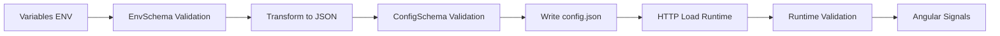

# ⚙️ Frontend Configuration - Angular & Tests

> **Configuration Angular** complète : variables d'environnement, tests E2E, et génération dynamique de config

## 🚀 TLDR - Configuration Rapide

### ⚡ Setup Variables E2E
```bash
# Le fichier .env.e2e est déjà versionné dans Git
# Variables critiques dans .env.e2e :
PUBLIC_ENVIRONMENT=test
PUBLIC_POSTHOG_ENABLED=false
PUBLIC_SUPABASE_URL=http://localhost:54321
PUBLIC_BACKEND_API_URL=http://localhost:3000/api/v1

# 3. Test configuration
cd frontend && pnpm generate:config  # Génère config.json
pnpm test:e2e                          # Lance tests E2E
```

### ⚡ Debug Config Angular
```bash
# Vérifier config générée
cat frontend/projects/webapp/public/config.json

# Test en développement
curl http://localhost:4200/config.json

# Regenerate si problème
cd frontend && pnpm generate:config
```

## 📋 Configuration Dynamique Angular {#config-generation}

### Architecture de Configuration
L'application Angular utilise un système de **configuration dynamique** avec **triple validation Zod** pour la sécurité et la type safety.



### Génération Build-Time
```bash
# Script: scripts/generate-config.ts
pnpm generate:config

# Workflow:
# 1. Lit variables d'environnement (process.env ou .env files)
# 2. Validation avec EnvSchema (strings → types)
# 3. Transform flat → nested structure
# 4. Validation avec ConfigSchema (JSON structure)
# 5. Écriture config.json dans public/
```

### Chargement Runtime
```typescript
// Dans Angular: core/config/application-configuration.ts
const configData = await this.http.get<ConfigFile>('/config.json').toPromise();
const validatedConfig = ConfigSchema.safeParse(configData); // 3ème validation
this.applyConfiguration(validatedConfig.data);
```

## 🧪 Tests E2E Configuration {#e2e-env}

### Environnement de Test Isolé
Les tests E2E utilisent `.env.e2e` pour un environnement complètement isolé avec des valeurs factices sécurisées.

### Variables E2E Requises
```env
# frontend/.env.e2e (versionné dans Git)
PUBLIC_ENVIRONMENT=test
PUBLIC_POSTHOG_ENABLED=false
PUBLIC_SUPABASE_URL=http://localhost:54321
PUBLIC_SUPABASE_ANON_KEY=ey...
PUBLIC_BACKEND_API_URL=http://localhost:3000/api/v1
PUBLIC_POSTHOG_HOST=disabled
PUBLIC_POSTHOG_API_KEY=xxx
```

### Workflow E2E Complet
```bash
# Playwright démarre avec .env.e2e
pnpm test:e2e
# → DOTENV_CONFIG_PATH=.env.e2e pnpm run start:ci
# → pnpm generate:config (avec variables test)
# → ng serve (app avec config test)
# → Tests E2E execute avec PostHog désactivé
```

## 📱 Configuration Angular App

### Structure de Configuration
```typescript
// Schéma de configuration (config.schema.ts)
export const ConfigSchema = z.object({
  environment: z.enum(['development', 'production', 'preview', 'local', 'test']),
  supabase: z.object({
    url: z.string().url(),
    anonKey: z.string().min(1)
  }),
  backend: z.object({
    apiUrl: z.string().url()
  }),
  postHog: z.object({
    enabled: z.boolean(),
    key: z.string(),
    host: z.string()
  })
});
```

### Configuration par Environnement
| Environnement | Source Variables | Configuration |
|---------------|------------------|---------------|
| **Développement** | `.env` (local, non versionné) | Vraies clés dev |
| **Tests E2E** | `.env.e2e` (versionné) | Valeurs factices |
| **CI GitHub** | `.env.e2e` (versionné) | Valeurs factices |
| **Production** | Vercel Dashboard | Vraies clés prod |

### Application de la Configuration
```typescript
// Service: application-configuration.ts
@Injectable({ providedIn: 'root' })
export class ApplicationConfiguration {
  // Signaux réactifs
  readonly config = signal<ApplicationConfig | null>(null);
  readonly isLoaded = computed(() => this.config() !== null);

  async loadConfiguration(): Promise<void> {
    const configData = await this.http.get<ConfigFile>('/config.json');
    const validatedConfig = safeValidateConfig(configData);
    this.applyConfiguration(validatedConfig.data);
  }
}
```

## 🔧 Troubleshooting Configuration

### Config.json Non Généré
```bash
# Vérifier variables env disponibles
env | grep PUBLIC_

# Test génération manuelle
cd frontend
tsx scripts/generate-config.ts

# Erreurs courantes:
# - Variable PUBLIC_* manquante
# - Format variable incorrect (URL invalide)
# - Permissions fichier public/
```

### Tests E2E Fail
```bash
# 1. Vérifier .env.e2e complet
ls -la frontend/.env.e2e

# 2. Variables manquantes check
cd frontend
DOTENV_CONFIG_PATH=.env.e2e pnpm generate:config

# 3. Debug Playwright
pnpm test:e2e:debug              # Mode debug interactif
```

### Configuration Runtime Fail
```bash
# 1. Vérifier config.json accessible
curl http://localhost:4200/config.json

# 2. Check validation errors dans browser console
# Angular DevTools → Console → Erreurs de validation

# 3. Force regeneration
cd frontend
rm projects/webapp/public/config.json
pnpm generate:config
```

### Variables Production (Vercel)
```bash
# Sync variables depuis Vercel
vercel env pull

# Test build production local
cd frontend
NODE_ENV=production pnpm build

# Variables critiques manquantes:
# PUBLIC_SUPABASE_URL
# PUBLIC_SUPABASE_ANON_KEY
# PUBLIC_BACKEND_API_URL
# PUBLIC_ENVIRONMENT=production
```

## 📊 Validation & Sécurité

### Triple Validation System
1. **Build-time** : EnvSchema valide variables env (string → types)
2. **Build-time** : ConfigSchema valide structure JSON finale
3. **Runtime** : ConfigSchema protège contre corruption/modification

### Sécurité
- **Variables sensibles** : Jamais exposées côté client
- **Validation Zod** : Empêche injection données malveillantes
- **Runtime protection** : Validation à chaque chargement
- **Test isolation** : PostHog désactivé, clés factices

### Type Safety
```typescript
// Types automatiquement inférés de Zod
type ApplicationConfig = z.infer<typeof ConfigSchema>;

// Usage type-safe dans composants
export class MyComponent {
  constructor(private config: ApplicationConfiguration) {
    effect(() => {
      const currentConfig = this.config.config();
      if (currentConfig) {
        // currentConfig est 100% typé
        console.log(currentConfig.supabase.url); // ✅ TypeScript happy
      }
    });
  }
}
```

## 📚 Commandes de Debug

```bash
# Configuration
cd frontend
pnpm generate:config                # Génère config.json
cat projects/webapp/public/config.json # Vérifier contenu

# Tests E2E
pnpm test:e2e                          # Tests complets
pnpm test:e2e:ui                       # Interface Playwright
pnpm test:e2e:debug                    # Mode debug
pnpm test:e2e:headed                   # Navigateur visible

# Variables environnement
env | grep PUBLIC_                     # Variables frontend
cd frontend && cat .env.e2e            # Config tests E2E
```
