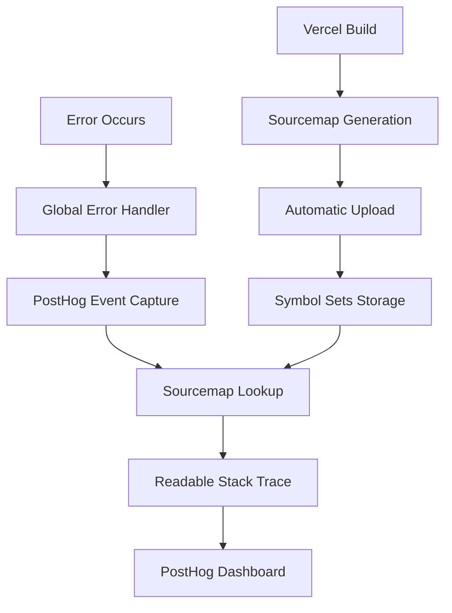

# 📊 Monitoring & Error Tracking - PostHog

> **Configuration complète PostHog** : sourcemaps automatiques, error tracking, et debugging en production

## 🚀 TLDR - Monitoring Opérationnel

### ⚡ Status Check Rapide
```bash
# Vérifier sourcemaps uploadés (logs Vercel)
# Chercher: "🎉 PostHog source maps processing completed!"

# Dashboard PostHog → Settings → Error tracking
# Vérifier présence Symbol Sets récents

# Test error tracking
curl https://www.pulpe.app/api/debug/error  # Force une erreur (dev only)
```

### ⚡ Variables Critiques Vercel
```env
# OBLIGATOIRES pour sourcemaps automatiques
POSTHOG_PERSONAL_API_KEY=phc_your_personal_api_key_here
POSTHOG_CLI_ENV_ID=12345
POSTHOG_HOST=https://eu.i.posthog.com
```

## 📋 Configuration PostHog Complète

### Architecture Error Tracking
L'application capture automatiquement toutes les erreurs avec contexte complet incluant version, commit, et stack traces lisibles via sourcemaps.



### Version Tracking Automatique
Chaque événement PostHog inclut automatiquement :

```typescript
// Super Properties (tous les événements)
app_version: "0.19.1"
app_commit: "e000f97"
environment: "production"
platform: "web"

// Person Properties (profil utilisateur)
first_app_version: "0.19.1"
first_commit: "e000f97"

// Événements d'erreur spécifiques
release: "0.19.1"
commit: "e000f97"
```

## 🔧 Sourcemaps Automatiques {#sourcemaps}

### Configuration Complète
L'upload des sourcemaps est **100% automatisé** dans le processus de déploiement Vercel. Aucune intervention manuelle requise.

### Variables Environnement Vercel
```env
# OBLIGATOIRE: Clé API personnelle PostHog
POSTHOG_PERSONAL_API_KEY=phc_your_personal_api_key_here

# OBLIGATOIRE: ID du projet PostHog (nombre entier)
POSTHOG_CLI_ENV_ID=12345

# OPTIONNEL: URL instance PostHog (défaut: EU)
POSTHOG_HOST=https://eu.i.posthog.com
```

**Important** : Ces variables sont déclarées dans `turbo.json` pour être accessibles au CLI PostHog pendant le build.

### Workflow Automatique
```bash
# Déclenchement automatique lors déploiement Vercel
1. Configuration génération ✅
2. Build Angular avec sourcemaps ✅
3. Upload automatique sourcemaps ✅
4. Déploiement Vercel ✅
```

### Obtenir les Clés PostHog

#### Clé API Personnelle
1. PostHog Dashboard → **Settings > Personal API Keys**
2. Créer nouvelle clé avec permissions `sourcemap:upload`
3. Copier la clé (format: `phc_...`)

#### Project ID
1. PostHog Dashboard → **Settings > Project variables**
2. Copier **Project ID** (nombre entier, ex: `12345`)
3. Utiliser pour `POSTHOG_CLI_ENV_ID`

## 📊 Error Tracking Configuration {#error-tracking}

### Capture Automatique
Les erreurs sont automatiquement capturées via `GlobalErrorHandler` avec contexte complet :

```typescript
// Erreurs non catchées automatiquement capturées
// Informations incluses:
// - Message d'erreur (sanitized)
// - Stack trace (avec sourcemaps)
// - URL de la page
// - Version et commit
// - User agent
// - Timestamp précis
```

### Capture Manuelle
```typescript
// Dans composant Angular
export class MyComponent {
  constructor(private postHog: PostHogService) {}

  onError(error: Error) {
    this.postHog.captureException(error, {
      component: 'MyComponent',
      action: 'user_action',
      // Contexte additionnel
    });
  }
}
```

### Filtres Disponibles (Dashboard)
```bash
# Filtres PostHog Dashboard
app_version = "2025.11.0"           # Erreurs version spécifique
environment = "production"          # Production uniquement
error_type = "TypeError"           # Type d'erreur
user_id = "user-123"               # Erreurs utilisateur spécifique
```

## 🔍 Debugging & Utilisation {#troubleshooting}

### Identifier une Erreur
1. **PostHog Dashboard** → Events → Errors
2. Filtrer par `app_version` si nécessaire
3. Cliquer sur erreur pour contexte complet :
   - Stack trace avec fichiers/lignes originaux
   - Version et commit exacts
   - Contexte utilisateur et page

### Corréler avec Déploiements
- Chaque version correspond à un commit Git
- Chaque déploiement a ses propres sourcemaps
- Timeline des erreurs visible par version
- Symbol sets conservés 90 jours

### Métriques Utiles
- **Erreurs par version** : Impact des releases
- **Top erreurs** : Priorités de fix
- **Régression** : Nouvelles erreurs après déploiement
- **Adoption** : Répartition des versions en production

## 🛠️ Troubleshooting Sourcemaps

### Erreur: "POSTHOG_PERSONAL_API_KEY environment variable is required"
**Cause** : Clé API non configurée dans Vercel

**Solution** :
```bash
# 1. Vérifier variables Vercel Dashboard
# 2. Ajouter POSTHOG_PERSONAL_API_KEY
# 3. Redéployer
```

### Erreur: "POSTHOG_CLI_ENV_ID environment variable is required"
**Cause** : Project ID PostHog manquant

**Solution** :
```bash
# 1. PostHog Dashboard → Settings → Project variables
# 2. Copier Project ID
# 3. Ajouter POSTHOG_CLI_ENV_ID dans Vercel
# 4. Redéployer
```

### Erreur: "Couldn't load credentials"
**Cause** : Variables incomplètes ou permissions API insuffisantes

**Solution** :
```bash
# 1. Vérifier 3 variables dans Vercel:
#    - POSTHOG_PERSONAL_API_KEY
#    - POSTHOG_CLI_ENV_ID
#    - POSTHOG_HOST (optionnel)
# 2. Vérifier permissions API key (sourcemap:upload)
# 3. Confirmer Project ID correct
```

### Stack Traces Toujours Minifiées
**Causes possibles** :
- Sourcemaps pas uploadées
- Symbol Sets manquants/expirés
- Version mismatch

**Solutions** :
```bash
# 1. Vérifier upload dans logs Vercel
# Chercher: "PostHog source maps processing completed!"

# 2. Dashboard PostHog → Settings → Error tracking
# Vérifier Symbol Sets récents

# 3. Attendre propagation (quelques minutes)

# 4. Test upload manuel (debug)
cd frontend
pnpm upload:sourcemaps  # Nécessite POSTHOG_PERSONAL_API_KEY local
```

## 🔐 Sécurité & Données

### Données Automatiquement Masquées
- **Données financières** : Montants et transactions
- **PII** : Emails et données sensibles
- **Mots de passe** : Automatiquement redacted
- **Tokens** : API keys masquées

### Sourcemaps Sécurisées
- **Non exposées publiquement** : `hidden: true` configuration
- **Upload sécurisé** : API key personnelle requise
- **Rétention limitée** : Symbol sets conservés 90 jours
- **Isolation** : Chaque déploiement = Symbol set unique

### Configuration Production
- PostHog activé uniquement en production
- Désactivé automatiquement en développement/test
- Variables sécurisées via Vercel Dashboard
- Rotation régulière des API keys

## 📚 Commandes Debug Monitoring

```bash
# Status sourcemaps
# → Vercel build logs: "PostHog source maps processing completed!"

# Variables check
vercel env pull                        # Sync variables locales
env | grep POSTHOG                     # Vérifier variables

# Test upload manuel (debug uniquement)
cd frontend
pnpm upload:sourcemaps              # Nécessite POSTHOG_PERSONAL_API_KEY

# Dashboard liens rapides
# PostHog → Settings → Error tracking → Symbol Sets
# PostHog → Events → Errors (filtres par version)
```

## 🎯 Workflow Monitoring Post-Release

```bash
# 1. Vérifier déploiement Vercel
vercel ls                              # Status derniers deployments

# 2. Confirmer sourcemaps upload
# Logs Vercel → "PostHog source maps processing completed!"

# 3. Monitor erreurs nouvelles
# PostHog Dashboard → Erreurs dernières 24h

# 4. Check adoption nouvelle version
# PostHog → app_version distribution
```

---

**Resources** :
- **PostHog Error Tracking** : https://posthog.com/docs/error-tracking
- **Symbol Sets Management** : Dashboard PostHog > Settings > Error tracking
- **Variables critiques** : [DEPLOYMENT.md](./DEPLOYMENT.md)