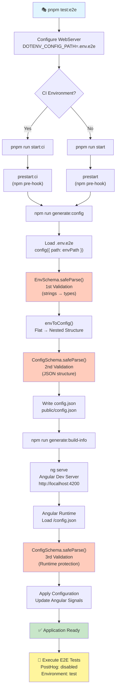
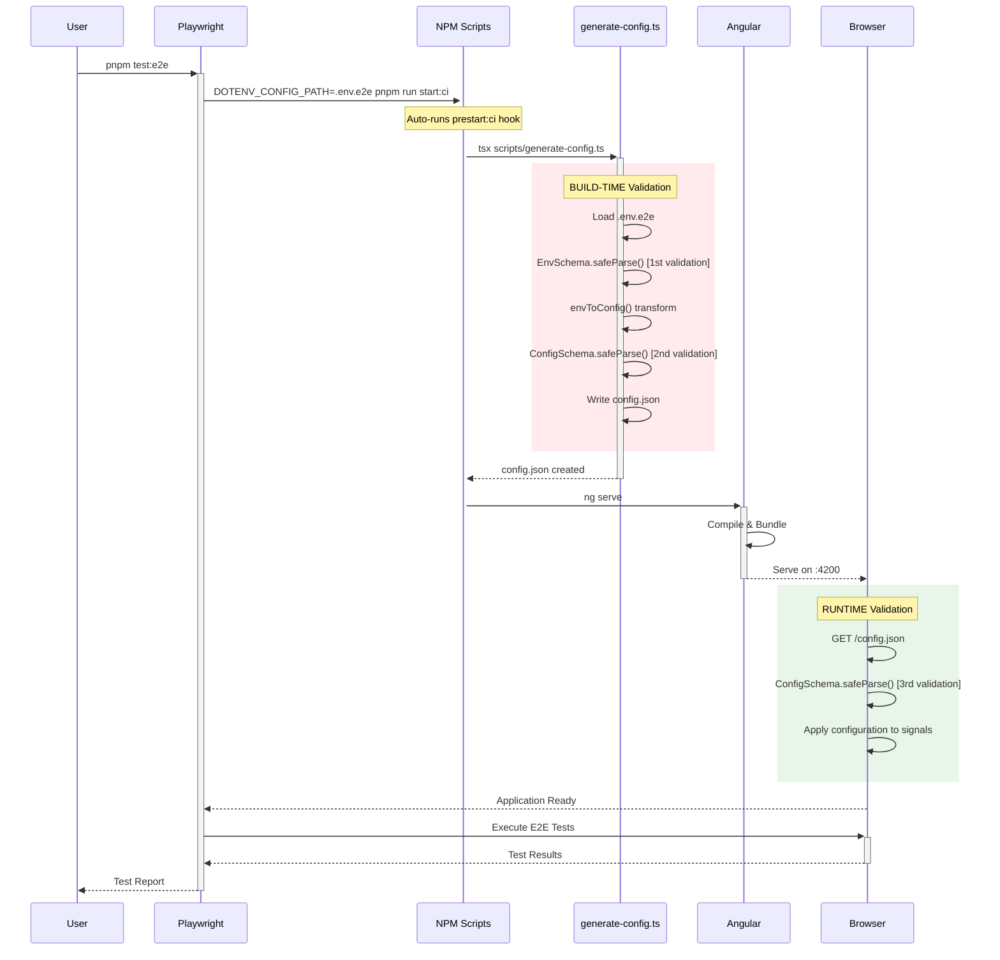
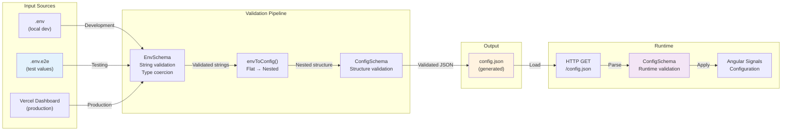

🎭 Workflow Complet : E2E Tests avec Configuration Dynamique

## 🚀 TLDR - Étapes clés

1. **Playwright démarre** → charge `.env.e2e` → lance `pnpm start:ci`
2. **Build-time** → `generate-config.ts` valide env vars → crée `config.json`
3. **Angular serve** → app démarre avec configuration générée
4. **Runtime** → app charge `/config.json` → triple validation Zod
5. **Tests E2E** → environnement isolé avec PostHog désactivé

**🎯 Avantages :** Type safety, source unique de vérité, sécurité renforcée, CI sans secrets

---

📋 Vue d'ensemble

Voici le workflow complet de l'exécution des tests E2E Playwright avec la génération dynamique de configuration utilisant Zod comme source unique de vérité.

🔄 Flux d'exécution détaillé

1. Lancement de Playwright 🎭

pnpm test:e2e

2. Configuration des Variables d'Environnement 🔧

webServer: {
command: process.env.CI
? 'DOTENV_CONFIG_PATH=.env.e2e pnpm run start:ci'
: 'DOTENV_CONFIG_PATH=.env.e2e pnpm run start',
port: 4200,
reuseExistingServer: false,
cwd: \_\_dirname, // Force exécution depuis frontend/
}

- Variables transmises: DOTENV_CONFIG_PATH=.env.e2e
- Commande lancée: pnpm run start:ci (en CI) ou pnpm run start (local)

3. Scripts npm en Cascade 📦

{
"prestart:ci": "npm run generate:config && npm run generate:build-info",
"start:ci": "ng serve",
"generate:config": "tsx scripts/generate-config.ts"
}

**Note :** npm exécute automatiquement `prestart:ci` avant `start:ci` grâce au mécanisme natif de scripts pré/post-hooks.

4. Génération de Configuration (BUILD-TIME) ⚙️

Fichier: scripts/generate-config.ts

4.1 Chargement des Variables d'Environnement

const envPath = process.env.DOTENV_CONFIG_PATH || ".env";
config({ path: envPath }); // Charge .env.e2e

4.2 Validation avec EnvSchema (1ère validation)

const envResult = EnvSchema.safeParse(process.env);

- Rôle: Valide les variables string depuis .env.e2e
- Transformations: "true" → boolean, "0.1" → number
- Format: Flat (PUBLIC_SUPABASE_URL, PUBLIC_POSTHOG_ENABLED, etc.)

  4.3 Transformation des Données

const applicationConfig = envToConfig(env);

- Rôle: Transforme structure plate → structure imbriquée
- Input: PUBLIC_SUPABASE_URL → Output: supabase.url

  4.4 Validation Finale avec ConfigSchema (2ème validation)

const configResult = ConfigSchema.safeParse(applicationConfig);

- Rôle: Valide la structure JSON finale
- Format: Nested avec types natifs (boolean, number)
- Sécurité: Vérifie que la transformation est correcte

  4.5 Écriture du Fichier

writeFileSync(outputPath, JSON.stringify(validatedConfig, null, 2));

- Destination: projects/webapp/public/config.json (fichier ignoré par Git)

5. Construction Angular 🏗️

ng serve

- Action: Compile l'application Angular
- Inclus: Le fichier config.json dans les assets publics
- Serveur: Démarre sur http://localhost:4200

6. Initialisation Angular (RUNTIME) 🚀

Fichier: application-configuration.ts

6.1 Chargement du Config.json

const configData = await firstValueFrom(
this.#http.get<ConfigFile>('/config.json', { headers })
);

- Via: HTTP GET request
- Cache: Headers no-cache pour forcer le rechargement

  6.2 Validation Runtime (3ème validation)

const validationResult = safeValidateConfig(configData);

- Rôle: Protège contre corruption/modification du fichier
- Schema: Même ConfigSchema qu'au build-time
- Sécurité: Garantit l'intégrité des données

  6.3 Application de la Configuration

this.#applyConfiguration(validatedConfig.data);

- Action: Met à jour les signaux Angular
- Sanitization: URLs validées et nettoyées
- Logs: Configuration PostHog et environnement

7. Exécution des Tests E2E 🧪

- Application prête: Configuration validée et appliquée
- PostHog: Désactivé (PUBLIC_POSTHOG_ENABLED=false dans .env.e2e)
- Environnement: test
- Tests: Exécution avec configuration isolée

📊 Résumé des Validations

| Étape         | Schema       | Format     | Rôle                                    |
| ------------- | ------------ | ---------- | --------------------------------------- |
| 1. Build-time | EnvSchema    | Strings    | Valide variables env + transforme types |
| 2. Build-time | ConfigSchema | JSON types | Valide structure finale avant écriture  |
| 3. Runtime    | ConfigSchema | JSON types | Protège contre corruption fichier       |

🎯 Points Clés

✅ Avantages du Système

- Source unique de vérité: Zod définit toutes les règles
- Type safety: TypeScript de bout en bout
- Triple validation: Env vars → Structure → Runtime
- Isolation: Tests E2E avec configuration dédiée
- Sécurité: Protection contre corruption/modification

🔒 Sécurité

- Variables sensibles dans .env.e2e (clés factices pour tests)
- PostHog désactivé en mode test
- Validation Zod empêche injection de données malveillantes
- Runtime validation protège contre tampering
- Config.json obligatoire - pas de fallback en production/test

🏗️ Architecture

.env.e2e → EnvSchema → envToConfig() → ConfigSchema → config.json → HTTP → ConfigSchema → Angular
(input) (validate) (transform) (validate) (file) (load) (protect) (use)

✅ Local Development

pnpm start

# → Lit .env (local, non versionné)

# → generate-config.ts crée config.json avec vos valeurs dev

# → Angular démarre avec config dev

✅ Tests E2E (Local & CI)

pnpm test:e2e

# → DOTENV_CONFIG_PATH=.env.e2e pnpm run start:ci

# → Lit .env.e2e (versionné, valeurs factices)

# → generate-config.ts crée config.json avec valeurs test

# → Playwright teste avec config isolée

✅ CI GitHub Actions

# .github/workflows/test.yml

- run: pnpm test:e2e

# → Utilise .env.e2e (versionné dans le repo)

# → Pas besoin de secrets GitHub pour les tests

# → Valeurs factices mais fonctionnelles

✅ Vercel Production/Preview

# Vercel build

pnpm run build

# → PAS de fichier .env

# → process.env contient les variables Vercel

# → generate-config.ts lit process.env.PUBLIC\_\*

# → Crée config.json avec les vraies valeurs prod

📊 Résumé des Sources

| Environnement | Source des variables | Versionné ?   | Valeurs       |
| ------------- | -------------------- | ------------- | ------------- |
| Dev local     | .env                 | ❌ Non        | Vraies (dev)  |
| Tests E2E     | .env.e2e             | ✅ Oui        | Factices      |
| CI GitHub     | .env.e2e             | ✅ Oui        | Factices      |
| Vercel        | Dashboard Vercel     | ❌ (sécurisé) | Vraies (prod) |

🔒 Sécurité Parfaite

- .env → gitignored (vos vraies clés dev)
- .env.e2e → versionné (clés factices pour tests)
- Vercel → Variables dans dashboard (chiffrées, jamais dans Git)

✨ Pourquoi c'est Excellent

1. Zéro configuration pour les contributeurs (.env.e2e versionné)
2. Tests reproductibles partout (même config)
3. Secrets sécurisés (jamais dans Git)
4. Un seul workflow (generate-config.ts partout)
