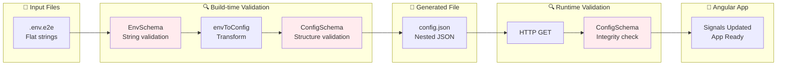
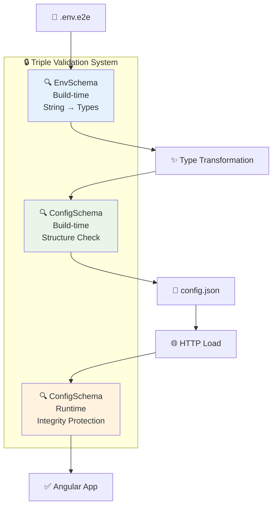
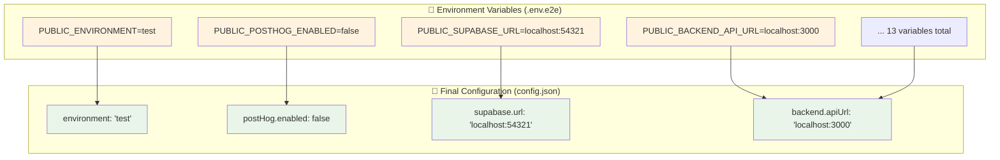
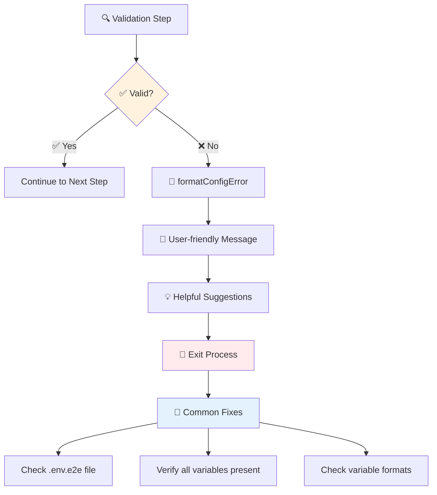
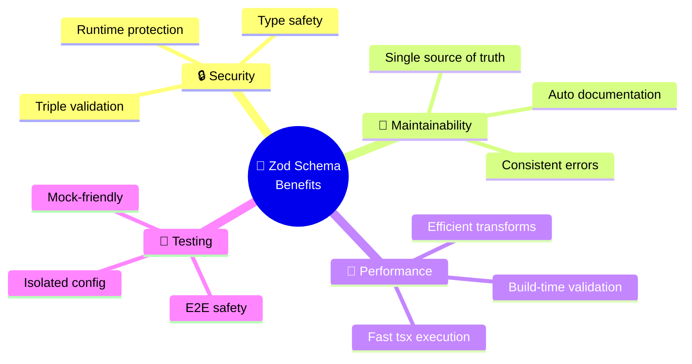
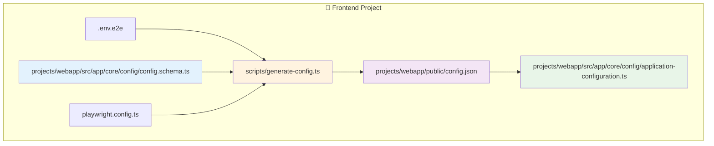

# 🎭 E2E Configuration Workflow

## Architecture Overview

```mermaid
flowchart TD
    A[🎭 pnpm test:e2e] --> B[📄 playwright.config.ts]
    B --> C[🚀 webServer.command<br/>DOTENV_CONFIG_PATH=.env.e2e]

    C --> D[📦 pnpm run start:ci]
    D --> E[⚙️ npm run generate:config]
    E --> F[🔨 tsx scripts/generate-config.ts]

    F --> G[📋 Read process.env.DOTENV_CONFIG_PATH]
    G --> H[🔧 config({ path: envPath })]
    H --> I[🔍 EnvSchema.parse]
    I --> J{✅ Valid?}
    J -->|❌ No| K[💥 Exit with Error]
    J -->|✅ Yes| L[🔄 envToConfig]

    L --> M[🔍 ConfigSchema.parse]
    M --> N{✅ Valid?}
    N -->|❌ No| K
    N -->|✅ Yes| O[📄 Write config.json]

    O --> P[🏗️ ng serve]
    P --> Q[🌐 Angular App Start]

    Q --> R[📡 HTTP GET /config.json]
    R --> S[🔍 ConfigSchema.parse]
    S --> T{✅ Valid?}
    T -->|❌ No| U[⚠️ Fallback Config]
    T -->|✅ Yes| V[✅ Apply Configuration]

    V --> W[🧪 E2E Tests Execute]

    style A fill:#e1f5fe
    style G fill:#fff3e0
    style I fill:#f3e5f5
    style M fill:#f3e5f5
    style S fill:#f3e5f5
    style W fill:#e8f5e8
```

## Data Flow Detail



## Validation Layers



## Environment Configuration



## Error Handling Flow



## Key Benefits



## File Structure



---

## Summary

This workflow ensures **type-safe**, **validated**, and **isolated** configuration for E2E tests using:

- 🎭 **Playwright** orchestration
- 🔍 **Zod** validation (3 layers)
- ⚡ **tsx** TypeScript execution
- 🔒 **Triple validation** (env → structure → runtime)
- 🧪 **Test isolation** with dedicated `.env.e2e`

The system is **robust**, **maintainable**, and provides **excellent developer experience** with clear error messages and type safety throughout! 🎉