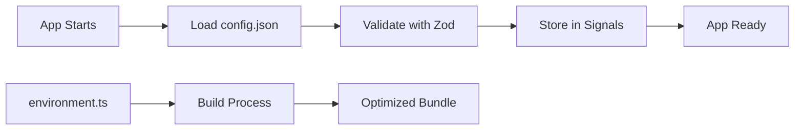

# Configuration Architecture

This document explains the configuration architecture for the Pulpe frontend application and why we use runtime configuration instead of build-time environment files.

## TL;DR

- ✅ **Runtime configuration** (`config.json`) for API URLs and keys
- ✅ **Build-time configuration** (`environment.ts`) for optimization flags only
- ✅ **Supabase anon keys** are safe to expose (protected by Row Level Security)

## Architecture Overview

### Runtime Configuration (`config.json`)

The application loads configuration at **runtime** from `/config.json`:

```json
{
  "supabase": {
    "url": "https://your-project.supabase.co",
    "anonKey": "eyJhbGciOiJIUzI1NiIsInR5cCI6IkpXVCJ9..."
  },
  "backend": {
    "apiUrl": "https://api.pulpe.app/api/v1"
  },
  "environment": "production"
}
```

This file is:
- Loaded via HTTP when the application starts
- Validated with Zod schemas for type safety
- Stored in Angular signals for reactive updates
- Can be different per deployment without rebuilding

### Build Configuration (`environment.ts`)

The `environment.ts` files contain **build optimization flags only**:

```typescript
// environment.ts (production)
export const environment = {
  production: true  // Enables minification, tree-shaking, etc.
};

// environment.development.ts
export const environment = {
  production: false  // Disables optimizations for faster builds
};
```

These files control:
- Minification and uglification
- Tree-shaking and dead code elimination
- Source map generation
- Bundle size optimizations
- Development vs production Angular behaviors

## Why Runtime Configuration?

### 1. Build Once, Deploy Everywhere

With runtime configuration, you can:
- Build a single Docker image
- Deploy to multiple environments (dev, staging, prod)
- Change configuration without rebuilding
- Follow modern CI/CD best practices

### 2. Container & Cloud Native

Modern deployment strategies require:
- **Immutable artifacts**: One build, many deployments
- **Environment parity**: Same code in all environments
- **Configuration flexibility**: Change settings without code changes
- **12-Factor App compliance**: Separate config from code

### 3. Security Considerations

**Q: Is it safe to expose Supabase anon keys in config.json?**

**A: Yes, when Row Level Security (RLS) is enabled.**

The Supabase anon key is:
- Designed to be public (like a Firebase API key)
- Limited by Row Level Security policies
- Only allows operations explicitly permitted by RLS
- Cannot bypass database security rules

Our RLS policies ensure:
- Users can only access their own data
- All tables have `ENABLE ROW LEVEL SECURITY`
- Policies check `auth.uid()` for user isolation
- No public access without authentication

### 4. Angular Best Practices 2025

The Angular team recommends:
- Use `APP_INITIALIZER` for runtime configuration
- Keep `environment.ts` for build-time constants only
- Load configuration before app bootstrap
- Validate configuration with schemas (we use Zod)

## Configuration Flow



## Adding New Configuration

To add new configuration values:

1. **Update the Zod schema** (`config.schema.ts`):
```typescript
export const ConfigSchema = z.object({
  // ... existing fields
  myNewConfig: z.string().url(), // Add your field
});
```

2. **Update the config files**:
```json
{
  "myNewConfig": "https://example.com"
}
```

3. **Use in your service**:
```typescript
const myConfig = this.appConfig.rawConfiguration()?.myNewConfig;
```

## File Structure

```
core/config/
├── README.md                        # This file
├── application-configuration.ts    # Main configuration service
├── config.schema.ts                # Zod validation schemas
├── types.ts                        # TypeScript types (generated from Zod)
└── index.ts                        # Public API exports
```

## Local Development

For local development:
1. Copy `config.json` to `config.local.json`
2. Update with local values
3. The dev server will use the local file automatically

## Production Deployment

For production:
1. Build the application once: `pnpm build`
2. Deploy the dist folder to your server
3. Provide environment-specific `config.json`
4. No rebuild needed for configuration changes

## Security Notes

### ✅ Safe to Expose
- Supabase anon key (protected by RLS)
- Backend API URLs
- Environment names

### ❌ Never Expose
- Supabase service role key
- Private API keys
- Sensitive credentials

## Migration from Build-Time Config

If migrating from build-time configuration:

1. Move API URLs from `environment.ts` to `config.json`
2. Keep build flags in `environment.ts`
3. Update services to use `ApplicationConfiguration`
4. Test in all environments

## Troubleshooting

### Config Not Loading
- Check browser network tab for 404 on `/config.json`
- Verify file exists in `public/` directory
- Check CORS if loading from different domain

### Validation Errors
- Check browser console for Zod validation errors
- Verify config matches schema structure
- Ensure all required fields are present

### Type Errors
- Run `pnpm type-check` to verify types
- Types are auto-generated from Zod schema
- Check imports from `./types`

## References

- [Angular Runtime Configuration Best Practices](https://angular.dev/tools/cli/environments)
- [Supabase Security Documentation](https://supabase.com/docs/guides/database/secure-data)
- [12-Factor App Configuration](https://12factor.net/config)
- [Zod Schema Validation](https://zod.dev)