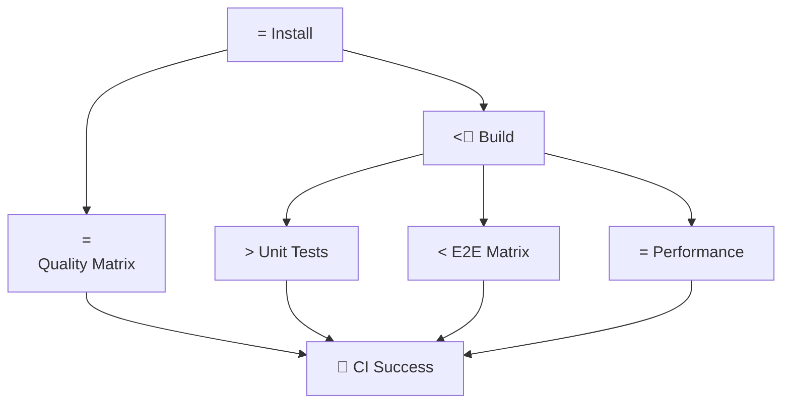

# Memory Bank - Documentation complète

Généré le: 2025-10-05 11:12:54

## Table des matières

- [Project Brief](#project-brief)
- [Specifications](#specifications)
- [Design](#design)
- [Architecture](#architecture)
- [Database](#database)
- [Infrastructure](#infrastructure)
- [Codebase Structure](#codebase-structure)
- [Decisions](#decisions)


---

## Project Brief
*Source: memory-bank/PROJECT_BRIEF.md*

# Pulpe - Project Brief

## What is Pulpe

Pulpe is a personal budget management application designed for the Swiss market. It enables users to plan their financial year using reusable monthly templates, ensuring they always know how much they can spend and how much they'll save.

## Core Philosophy

- **Planning > Tracking** - Plan ahead rather than track after the fact
- **Anticipation > Reaction** - Foresee expenses rather than react to them
- **Serenity > Control** - Achieve peace of mind over obsessive financial tracking
- **Simplicity > Completeness** - Prioritize simplicity over exhaustive features

## Value Proposition

> Pulpe allows users to plan their year with reusable month templates. Users always know how much they can spend and how much they will save.

## How It Works

1. **Templates**: Create reusable budget templates defining typical monthly income, expenses, and savings
2. **Budgets**: Generate monthly budgets from templates for yearly planning
3. **Transactions**: Track actual spending with manual transaction entry
4. **Rollover**: Automatic propagation of surplus or deficit to the following month

## Core Business Model

### Financial Flow Types

- **Income**: Money coming into the monthly budget
- **Expense**: Money going out (living costs, purchases)
- **Saving**: Planned savings treated as expenses to ensure realization

### Key Calculations

- **Available**: Total usable amount (income + rollover from previous month)
- **Remaining**: What's left to spend (available - expenses)
- **Rollover**: Automatic transfer of surplus/deficit to next month

## What Pulpe Does (V1)

**Included Features**:

- Annual planning with reusable templates
- Monthly budget tracking vs. actual spending
- Automatic rollover mechanism between months
- Budget overspending alerts at 80%, 90%, 100%
- Clear distinction between planned (budget lines) and actual (transactions)

**Not Included**:

- Multi-currency support (CHF only)
- Bank account synchronization
- Shared budgets between users
- Advanced transaction categorization
- Automatic recurring transactions
- Long-term financial projections

## Target Users

- **Primary**: Swiss residents with regular monthly income
- **Mindset**: People who prefer planning over reactive tracking
- **Need**: Users seeking simplicity in personal budget management
- **Context**: Single-user budgeting (no family/shared budgets)

## Project Context

- Developed and maintained by a single developer
- Focus on Swiss market and CHF currency
- Emphasis on YAGNI (You Aren't Gonna Need It) and KISS (Keep It Simple, Stupid) principles
- Modern web application with mobile-responsive design


---

## Specifications
*Source: memory-bank/SPECS.md*

# Product Specification: Pulpe (V1)

## 1. Vision & Philosophie

### Philosophie Produit

* **Planning** > Tracking (Planifier plutôt que subir)
* **Anticipation** > Reaction (Prévoir plutôt que réagir)
* **Serenity** > Control (Sérénité plutôt que contrôle obsessionnel)
* **Simplicity** > Completeness (Simplicité plutôt qu'exhaustivité)

### Proposition de Valeur

> Pulpe permet de planifier l'année avec des modèles de mois réutilisables. L'utilisateur sait toujours combien il peut dépenser et combien il va épargner.

### Parcours Utilisateur Type

```
1. Onboarding    : Configuration du profil + revenus + charges fixes
2. Templates     : Création de modèles de mois réutilisables
3. Budgets       : Génération automatique des budgets mensuels depuis les templates
4. Tracking      : Ajustement via saisie des transactions réelles
5. Monitoring    : Visualisation de l'épargne et du disponible
```

---

## 2. Concepts Métier & Définitions

### Types de Flux Financiers

* **Income** (Revenu) : Toute entrée d'argent dans le budget mensuel
* **Expense** (Dépense) : Toute sortie d'argent du budget mensuel
* **Saving** (Épargne) : Objectif de mise de côté, traité comptablement comme une sortie d'argent pour garantir sa réalisation

> 💡 **Note importante** : Le saving est volontairement traité comme une expense dans les calculs pour forcer l'utilisateur à "budgéter" son épargne plutôt que d'épargner "ce qui reste".

### Concepts de Gestion

* **Template** : Modèle réutilisable de mois contenant la structure des revenus, dépenses et épargne prévus
* **Budget** : Instance mensuelle créée à partir d'un template, modifiable indépendamment
* **Budget Line** : Ligne de budget planifiée (income, expense ou saving)
* **Transaction** : Opération réelle saisie par l'utilisateur pour ajuster le budget

### Indicateurs Calculés

* **Available** (Disponible) : Montant total utilisable pour le mois = `Income + Rollover`
  * *Représente l'argent total à disposition pour le mois en cours*
  
* **Expenses** (Dépenses totales) : `Σ(budget_lines type expense/saving) + Σ(transactions type expense/saving)`
  * *Somme de toutes les sorties d'argent planifiées et réelles*
  
* **Remaining** (Restant) : `Available - Expenses`
  * *Montant encore disponible à dépenser dans le mois*

* **Progress** (Progression) : `(Expenses ÷ Available) × 100`
  * *Pourcentage du budget consommé (plafonné visuellement à 100%)*

---

## 3. Modèle de Calcul

### Principe de Base

Le système repose sur un **chaînage automatique** des mois via le mécanisme de rollover :

```
Mois M   : ending_balance = (income + rollover_from_M-1) - expenses
Mois M+1 : rollover = ending_balance_from_M
```

### Stockage & Calcul

* **Stocké en base** : `ending_balance` pour chaque mois
* **Calculé dynamiquement** : `rollover` depuis l'ending_balance du mois précédent
* **Premier mois** : rollover = 0 (pas de mois précédent)

### Formules Détaillées

```sql
-- Pour un mois M donné :
income_M        = SUM(budget_lines WHERE type = 'income')
expenses_M      = SUM(budget_lines WHERE type IN ('expense', 'saving')) 
                + SUM(transactions WHERE type IN ('expense', 'saving'))
rollover_M      = ending_balance_M-1  -- (0 si premier mois)
available_M     = income_M + rollover_M
remaining_M     = available_M - expenses_M
ending_balance_M = remaining_M  -- Stocké en base
```

### Exemple de Chaînage

```
Janvier  : income=5000 CHF, expenses=4500 CHF, rollover=0     → ending_balance=500 CHF
Février  : income=5200 CHF, expenses=4800 CHF, rollover=500 CHF  → ending_balance=900 CHF
Mars     : income=5100 CHF, expenses=5200 CHF, rollover=900 CHF  → ending_balance=800 CHF
Avril    : income=5000 CHF, expenses=5500 CHF, rollover=800 CHF  → ending_balance=300 CHF
```

> ⚠️ **Important** : Un ending_balance négatif se propage automatiquement comme rollover négatif au mois suivant (dette technique).

---

## 4. Hypothèses & Limitations

### Ce que Pulpe V1 fait

✅ Planification annuelle basée sur des templates  
✅ Suivi mensuel des dépenses vs budget  
✅ Propagation automatique des excédents/déficits  
✅ Alertes de dépassement budgétaire  
✅ Distinction plan (budget_lines) vs réel (transactions)  

### Ce que Pulpe V1 NE fait PAS

❌ **Pas de multi-devises** : CHF uniquement (contexte Suisse)  
❌ **Pas de comptes bancaires** : Pas de synchronisation ou réconciliation bancaire  
❌ **Pas de budgets partagés** : Un budget par utilisateur uniquement  
❌ **Pas de catégorisation avancée** : Les transactions ne sont pas sous-catégorisées  
❌ **Pas de récurrence automatique** : Les transactions régulières doivent être saisies manuellement  
❌ **Pas d'objectifs long terme** : Focus sur le mois, pas de projections annuelles  
❌ **Pas de modification rétroactive** : Les mois clôturés sont figés (sauf ending_balance)  

### Hypothèses Métier

* L'utilisateur a des revenus réguliers mensuels
* L'épargne est un objectif prioritaire (pas un reste)
* Un déficit se reporte automatiquement (pas de blocage)
* L'utilisateur accepte une saisie manuelle des transactions

---

## 5. Workflows Principaux

### WF-000: Onboarding

**Objectif** : Permettre à l'utilisateur de démarrer immédiatement avec un budget fonctionnel

1. Saisie des informations de base (revenus + charges fixes)
2. Création automatique d'un template "Standard Month"
3. Génération du budget du mois en cours depuis ce template
4. Redirection vers le dashboard du mois courant

### WF-001: Planification Annuelle

**Objectif** : Générer rapidement 12 mois de budgets prévisionnels

1. Sélection d'un template de référence
2. Choix de la période (par défaut : année calendaire)
3. Génération de 12 budgets identiques
4. Possibilité d'ajuster chaque mois individuellement (primes, vacances, etc.)

### WF-002: Suivi Mensuel

**Objectif** : Suivre sa consommation budgétaire en temps réel

1. Consultation du dashboard (available, remaining, progress)
2. Ajout de transactions au fil de l'eau
3. Réception d'alertes aux seuils (80%, 90%, 100%)
4. Clôture automatique en fin de mois avec calcul du rollover

### WF-003: Mode Démo

**Objectif** : Permettre l'exploration de l'application sans inscription

1. Clic sur "Essayer en mode démo" (login ou onboarding)
2. Création automatique d'un utilisateur éphémère (backend)
3. Génération de données réalistes (templates, budgets, transactions)
4. Session active 24h avec auto-cleanup après expiration

---

## 6. Règles Métier

### RG-001: Cohérence Template ↔ Budget

* Lors de la modification d'un template (ajout/édition/suppression de lignes), deux options sont proposées :
  - **"Ne rien propager"** : Modifie uniquement le template. Les budgets existants ne sont PAS touchés. Seuls les nouveaux budgets créés après utiliseront le template modifié.
  - **"Propager"** : Modifie le template ET applique les changements aux budgets du mois en cours et futurs (jamais aux mois passés)
* Les budget lines manuellement ajustées (is_manually_adjusted = true) ne sont jamais modifiées lors de la propagation

### RG-002: Gestion des Dépassements

* **Seuil 80%** : Notification d'avertissement (orange)
* **Seuil 90%** : Alerte forte (rouge)
* **Seuil 100%+** : Dépassement autorisé avec rollover négatif au mois suivant

### RG-003: Atomicité des Opérations

* Création de budget depuis template : transaction complète ou annulation
* Modification de template : validation avant propagation
* Import de transactions : tout ou rien avec rapport d'erreur

### RG-004: Unicité et Contraintes

* Un seul template peut être marqué "default" par utilisateur
* Un seul budget par mois par utilisateur
* Au moins une ligne de type income obligatoire dans un template
* La somme expenses + savings ne doit pas dépasser les incomes dans un template (avertissement)

### RG-005: Gestion des Transactions

* Les transactions sont saisies manuellement par l'utilisateur
* Elles s'ajoutent aux budget lines (ne les remplacent pas)
* Pas de modification des transactions après saisie (V1)
* Les transactions impactent directement le calcul du remaining

---

## 7. Cas d'Usage Détaillés

### CU-001: Dashboard Mensuel

**Acteur** : Utilisateur connecté  
**Précondition** : Budget du mois existe  

**Affichage principal** :
- Montant available (grande police, position centrale)
- Montant remaining avec code couleur selon progression
- Barre de progression visuelle (vert → orange → rouge)
- Liste des 5 dernières transactions

**Actions rapides** :
- Bouton "Add Transaction" (flottant)
- Accès "View All Transactions"
- Lien "Edit Budget"

### CU-002: Création de Template Personnalisé

**Acteur** : Utilisateur connecté  
**Précondition** : Au moins un template existe déjà  

**Étapes** :
1. Duplication d'un template existant ou création vierge
2. Ajout/modification des lignes (au moins 1 income obligatoire)
3. Validation : vérification que expenses + savings ≤ income
4. Option : marquer comme template par défaut
5. Option : propager aux mois futurs

### CU-003: Gestion d'un Dépassement

**Acteur** : Utilisateur avec budget dépassé  
**Déclencheur** : remaining < 0  

**Comportement système** :
1. Notification immédiate à l'utilisateur
2. Affichage en rouge du montant dépassé
3. Calcul et affichage de l'impact sur le mois suivant
4. Proposition d'ajustement du budget du mois suivant

---

## 8. Glossaire Métier

| Terme EN | Terme FR | Définition | Contexte d'usage |
|----------|----------|------------|------------------|
| **Template** | Modèle | Structure réutilisable définissant les revenus, dépenses et épargne types d'un mois | "J'utilise mon template 'Mois standard' pour générer mes budgets" |
| **Budget** | Budget mensuel | Instance concrète d'un template pour un mois donné, modifiable indépendamment | "Mon budget de janvier est basé sur le template mais j'ai ajouté une prime" |
| **Budget Line** | Ligne budgétaire | Élément planifié du budget (salaire, loyer, épargne...) | "J'ai 15 budget lines dont 2 revenus et 13 dépenses" |
| **Transaction** | Transaction | Opération réelle saisie pour ajuster le budget par rapport au plan | "J'ai ajouté une transaction de 45 CHF pour le restaurant d'hier" |
| **Income** | Revenu | Entrée d'argent dans le budget mensuel | "Mes incomes incluent salaire + freelance" |
| **Expense** | Dépense | Sortie d'argent du budget (hors épargne) | "Mon expense loyer est de 1800 CHF" |
| **Saving** | Épargne | Montant mis de côté, traité comme une sortie prioritaire | "Mon saving mensuel est de 500 CHF pour le projet vacances" |
| **Available** | Disponible | Montant total utilisable ce mois (revenus + report) | "J'ai 5200 CHF available ce mois-ci" |
| **Remaining** | Restant | Ce qu'il reste à dépenser dans le mois | "Plus que 340 CHF remaining pour finir le mois" |
| **Ending Balance** | Solde de fin | Résultat final du mois après toutes les opérations | "Mon ending balance de janvier était de +200 CHF" |
| **Rollover** | Report | Excédent ou déficit reporté automatiquement au mois suivant | "J'ai un rollover négatif de -150 CHF suite au dépassement" |
| **Progress** | Progression | Pourcentage du budget consommé | "Je suis à 85% de progress, attention!" |
| **Overspending** | Dépassement | Situation où les dépenses excèdent le disponible | "Overspending de 200 CHF ce mois" |
| **Default Template** | Modèle par défaut | Template utilisé automatiquement si aucun choix explicite | "Mon default template inclut tous mes frais fixes" |

---

## 9. Évolutions Futures (hors V1)

* 🔮 Multi-devises avec taux de change
* 🔮 Budgets partagés (couple, famille)
* 🔮 Catégorisation avancée des transactions
* 🔮 Récurrence automatique des transactions
* 🔮 Projections et simulations
* 🔮 Export PDF/Excel des budgets
* 🔮 Synchronisation bancaire (PSD2)
* 🔮 Mode "vacances" avec budget journalier

---

*Document maintenu par l'équipe Pulpe - Dernière mise à jour : Version 1.0*

---

## Design
*Source: memory-bank/DESGIN.md*


---

## Architecture
*Source: memory-bank/ARCHITECTURE.md*

# Pulpe - System Architecture

*AI Context Document for AIDD/BMAD Workflow*

## Executive Summary

**System Purpose**: Personal budget management application for the Swiss market, enabling users to plan their financial year using reusable monthly templates with automatic rollover mechanisms.

**Core Philosophy**:
- Planning > Tracking (anticipate rather than react)
- Simplicity > Completeness (KISS & YAGNI principles)
- Isolation > DRY (3-5x more valuable for maintainability)

**Technology Stack**:
- Frontend: Angular 20 (Standalone Components + Signals)
- Backend: NestJS 11 (Bun runtime)
- Database: Supabase (PostgreSQL + Auth + RLS)
- Shared: Zod schemas + TypeScript types
- Mobile: iOS SwiftUI (future)
- Orchestration: Turborepo + PNPM workspaces

**Deployment**:
- Frontend: Vercel
- Backend: Railway
- Database: Supabase Cloud
- CDN/Assets: Vercel Edge Network

## System Architecture

### Monorepo Structure
```
pulpe-workspace/
├── frontend/           # Angular 20 web application
├── backend-nest/       # NestJS API with Bun runtime
├── shared/            # Zod schemas and TypeScript types
├── mobile/            # iOS SwiftUI application (future)
├── .cursor/           # AI development rules and patterns
├── turbo.json         # Turborepo orchestration
└── memory-bank/       # AIDD context files
```

### Package Dependencies
- **@pulpe/shared**: Core package with REST DTOs (Zod schemas only)
- **frontend**: Depends on @pulpe/shared for API contracts
- **backend-nest**: Depends on @pulpe/shared for DTO validation
- **mobile**: Future dependency on shared for API consistency

### Build Orchestration (Turborepo)
- Cache-first approach with intelligent dependency resolution
- Automatic build order: `shared → frontend & backend (parallel)`
- Development mode: Hot reload with shared package watching
- Commands: `pnpm dev` (full stack), `pnpm build` (production)

### Key Principles
- **Zero Breaking Changes**: Shared package versioning strategy
- **Type Safety**: End-to-end TypeScript + Zod validation
- **Performance First**: Lazy loading, OnPush detection, caching

## Frontend Architecture

### Framework Configuration
- **Angular 20** with strict mode, standalone components
- **Change Detection**: OnPush strategy for all components
- **State Management**: Angular signals + direct service access
- **Styling**: Tailwind CSS v4 + Angular Material v20
- **Testing**: Vitest (unit) + Playwright (E2E)

### Architectural Types (5-Layer Pattern)
```
frontend/projects/webapp/src/app/
├── core/       # Headless services, guards (eager-loaded)
├── layout/     # Application shell components (eager-loaded)
├── ui/         # Stateless reusable components (cherry-picked)
├── feature/    # Business domains (lazy-loaded)
└── pattern/    # Stateful reusable components (imported)
```

### Dependency Rules (Acyclic)
```
core     ← layout, feature, pattern
ui       ← layout, feature, pattern
pattern  ← feature
feature  ← (isolated, no sibling dependencies)
```

### Routing Strategy
- **Lazy Loading**: All features via `loadChildren`
- **Feature Isolation**: Complete separation between business domains
- **Nested Features**: Support for multi-level navigation

### State Management
- **Angular Signals**: Reactive state primitives
- **Domain Services**: Feature-specific state in `core/` or `feature/`
- **No Global Store**: Direct service injection pattern

### Key Patterns
- **Standalone Everything**: No NgModules
- **OnPush + Signals**: Performance optimization
- **Feature Black Box**: Throwaway and replaceable architecture

### Demo Mode Integration
- **DemoModeService**: Signal-based state management (localStorage sync)
- **DemoInitializerService**: API call + Supabase auth session setup
- **UI Integration**: Welcome screen + login page demo buttons

## Backend Architecture

### Framework Configuration
- **NestJS 11** with TypeScript strict mode
- **Runtime**: Bun for performance and modern JS features
- **Validation**: Global ZodValidationPipe
- **Documentation**: Swagger/OpenAPI auto-generation
- **Logging**: Pino structured logging with request correlation

### Module Structure
```
backend-nest/src/modules/[domain]/
├── [domain].controller.ts    # HTTP routes + validation
├── [domain].service.ts       # Business logic
├── [domain].mapper.ts        # DTO ↔ Entity transformation
├── [domain].module.ts        # DI configuration
├── dto/                      # NestJS DTOs (createZodDto)
└── entities/                 # Business entities
```

### Authentication & Security
- **JWT Tokens**: Supabase Auth integration
- **AuthGuard**: Global protection with custom decorators
- **RLS Policies**: Database-level security (auth.uid())
- **Zero Trust**: All endpoints protected by default

### API Design
- **REST**: RESTful endpoints with `/api/v1` prefix
- **Validation Pipeline**: Zod schemas → DTO validation → Business rules
- **Error Handling**: Global exception filter with structured responses
- **Documentation**: Auto-generated Swagger from DTOs

### Key Patterns
- **Controller → Service → Mapper**: Clear separation of concerns
- **Dependency Injection**: Constructor injection with decorators
- **Type Safety**: Supabase generated types + Zod validation

### Demo Mode System
- **Ephemeral Users**: Real Supabase users with `is_demo: true` metadata
- **Auto-cleanup**: Cron job every 6h deletes users > 24h old
- **Demo Data Generator**: Seeds templates, budgets, transactions
- **Security**: `@DevOnly()` guard for manual cleanup endpoint

## Data Architecture

### Database Platform
- **Supabase**: PostgreSQL with built-in auth, real-time, and REST API
- **Row Level Security (RLS)**: User data isolation at database level
- **Type Generation**: Automatic TypeScript types from schema

### Core Tables
```sql
auth.users                 -- Managed by Supabase Auth
public.monthly_budget       -- Monthly budget instances
public.transaction          -- Financial transactions
public.template            -- Budget templates (reusable)
public.template_line       -- Template transaction items
```

### Security Model
- **RLS Policies**: `WHERE auth.uid() = user_id` on all user tables
- **JWT Validation**: Backend validates tokens with Supabase
- **API Layer**: Additional business rule validation
- **Database**: Final constraint validation and RLS enforcement

### Data Flow
```
Frontend DTO (Zod) → Backend DTO (createZodDto) → Service Logic → Supabase Client → RLS → PostgreSQL
```

### Key Features
- **Automatic Rollover**: Monthly budget surplus/deficit propagation
- **Template System**: Reusable budget structures
- **Financial Calculations**: Server-side computed values

## Shared Package (@pulpe/shared)

### Purpose
Single source of truth for API contracts between frontend and backend.

### Content Strategy
- **Zod Schemas**: Runtime validation + type generation
- **REST DTOs Only**: No Supabase types (backend-only)
- **ESM Format**: Modern module system with proper exports

### Validation Pipeline
- **Frontend**: Client-side UX validation
- **Backend**: Server-side business validation
- **Database**: Structural validation + RLS

### Key Files
- `schemas.ts`: All Zod schemas and inferred types
- `index.ts`: Single export point
- `calculators/`: Business logic utilities

### Usage Pattern
```typescript
// Frontend
import { budgetCreateSchema, type BudgetCreate } from '@pulpe/shared';

// Backend
import { budgetCreateSchema } from '@pulpe/shared';
export class CreateBudgetDto extends createZodDto(budgetCreateSchema) {}
```

## Key Patterns & Conventions

### Authentication Flow
1. **Frontend**: Supabase Auth SDK manages JWT tokens
2. **Backend**: AuthGuard validates tokens with `supabase.auth.getUser()`
3. **Database**: RLS policies enforce data isolation
4. **API**: Custom decorators inject authenticated user context

### Error Handling
- **Global Exception Filter**: Structured error responses
- **Correlation IDs**: Request tracking across services
- **Sensitive Data Redaction**: Automatic PII filtering in logs
- **User-Friendly Messages**: Client-appropriate error formatting

### Testing Strategy
- **Unit Tests**: Business logic with mocked dependencies
- **Integration Tests**: API endpoints with real database
- **E2E Tests**: Critical user flows with Playwright
- **Performance Tests**: Load testing for API endpoints

### Development Conventions
- **Naming**: Descriptive, purpose-driven file names
- **Architecture**: Enforce via `eslint-plugin-boundaries`
- **Git Flow**: Feature branches with PR reviews
- **Code Quality**: Automated linting, formatting, type-checking
G

### API Contracts
- **REST API**: JSON over HTTP with `/api/v1` prefix
- **Content-Type**: `application/json` for all endpoints
- **Authentication**: `Bearer {jwt_token}` in Authorization header
- **Validation**: Zod schemas enforce contract compliance

### External Services
- **Supabase Auth**: User management and JWT validation
- **Supabase Database**: PostgreSQL with RLS and real-time features
- **Vercel**: Frontend hosting with edge network
- **Railway**: Backend hosting with automatic deployments

### Real-time Features
- **Database Changes**: Supabase real-time subscriptions (future)
- **WebSocket**: Not currently implemented
- **Server-Sent Events**: Not currently implemented

## Development Guidelines

### Essential Commands
```bash
# Full stack development
pnpm dev                    # Start all services
pnpm build                  # Build all packages
pnpm test                   # Run all tests

# Quality assurance
pnpm quality:fix            # Fix all auto-fixable issues
pnpm type-check             # TypeScript validation
```

### Environment Setup
1. **Node.js**: Bun runtime required for backend
2. **Database**: Local Supabase or cloud connection
3. **Auth**: Supabase credentials in environment
4. **IDE**: VS Code with Angular/NestJS extensions

### Debugging & Monitoring
- **Frontend**: Angular DevTools + browser console
- **Backend**: Structured logs with Pino + request correlation
- **Database**: Supabase dashboard + query performance
- **API**: Swagger documentation at `/docs`

### Performance Considerations
- **Bundle Size**: Lazy loading + tree shaking
- **Database**: RLS policy optimization with proper indexes
- **Caching**: Turborepo build cache + Vercel edge cache
- **Change Detection**: OnPush strategy + signals optimization

---

*This document provides essential context for AI-driven development following BMAD methodology principles.*

---

## Database
*Source: memory-bank/DATABASE.mmd*


---

## Infrastructure
*Source: memory-bank/INFRASTRUCTURE.md*

# Pulpe - Infrastructure Guide

*AI Context Document for AIDD/BMAD Workflow*

## Executive Summary

**Infrastructure Purpose**: Modern monorepo development and deployment infrastructure optimized for a single-developer workflow with professional CI/CD practices.

**Core Principles**:
- **Developer Experience First**: Local development mirrors production
- **Automation Over Manual Work**: CI/CD handles quality gates and deployments
- **Cost Optimization**: Leverage free tiers and open-source tooling
- **Simplicity Over Complexity**: KISS and YAGNI principles throughout

**Tech Stack Summary**:
- **Development**: Turborepo + PNPM + Local Supabase
- **CI/CD**: GitHub Actions with intelligent caching
- **Deployment**: Multi-platform (Vercel + Railway + Supabase Cloud)
- **Monitoring**: PostHog analytics + structured logging

## Development Infrastructure

### Local Development Environment

**Core Requirements**:
```bash
# Required tools
Node.js 22.x               # Runtime environment
pnpm 10.12.1+              # Package manager
Bun 1.2.17+                # Backend runtime
Supabase CLI               # Database management
Docker Desktop             # Required for Supabase local
```

**Single Command Setup**:
```bash
# Complete development stack
pnpm dev                   # Orchestrates: shared build  frontend + backend dev servers
```

### Monorepo Architecture (Turborepo + PNPM)

**Package Structure**:
```
pulpe-workspace/
 shared/                # @pulpe/shared - API contracts (Zod schemas)
 frontend/              # pulpe-frontend - Angular 20 application
 backend-nest/          # backend-nest - NestJS API with Bun
 mobile/                # PulpeApp - iOS SwiftUI (future)
 turbo.json             # Build orchestration
 pnpm-workspace.yaml    # Package management
```

**Dependency Graph**:
```
@pulpe/shared (ESM package)
     workspace:* dependency
frontend + backend (parallel consumption)
     build outputs
Production artifacts
```

**Key Orchestration Features**:
- **Intelligent Caching**: Rebuild only changed packages
- **Automatic Dependencies**: `shared` builds before consumers
- **Parallel Execution**: Independent tasks run simultaneously
- **Type Safety**: Shared schemas ensure API contract compliance

### Environment Configuration Strategy

**Environment Hierarchy**:
1. **Development**: `.env.local` (local Supabase, ignored by Git)
2. **CI/CD**: `.env.ci` (GitHub Actions with local Supabase)
3. **Production**: Environment variables (Vercel/Railway)

**Configuration Sources**:
- **Backend**: Environment variables  `.env` files
- **Frontend**: Dynamic `config.json` generation from `PUBLIC_*` env vars
- **Shared**: No environment dependencies (pure ESM)

**Critical Environment Variables**:
```bash
# Backend (backend-nest/.env)
NODE_ENV=development|test|production
SUPABASE_URL=https://project.supabase.co
SUPABASE_ANON_KEY=eyJ...
SUPABASE_SERVICE_ROLE_KEY=eyJ...

# Frontend (Vercel environment variables)
PUBLIC_SUPABASE_URL=https://project.supabase.co
PUBLIC_SUPABASE_ANON_KEY=eyJ...
PUBLIC_BACKEND_API_URL=https://api.domain.com/api/v1
PUBLIC_ENVIRONMENT=development|production
```

## Build & Orchestration

### Turborepo Configuration

**Core Task Configuration**:
```json
{
  "tasks": {
    "build": {
      "dependsOn": ["^build"],
      "outputs": ["dist/**", ".next/**"],
      "env": ["NODE_ENV"]
    },
    "dev": {
      "cache": false,
      "persistent": true,
      "dependsOn": ["^build"]
    },
    "test": {
      "dependsOn": ["^build"],
      "outputs": ["coverage/**"]
    }
  }
}
```

**Performance Optimizations**:
- **Cache Strategy**: Content-based hashing with filesystem cache
- **Incremental Builds**: Only rebuild changed packages
- **Parallel Tasks**: Independent operations run concurrently
- **Dependency Respect**: Automatic build order enforcement

**Common Commands**:
```bash
# Development workflows
pnpm dev                   # Full stack development
pnpm dev:frontend-only     # Frontend + shared only
pnpm dev:backend-only      # Backend + shared only

# Build operations
pnpm build                 # Production builds with caching
pnpm build --filter=shared # Build specific package
pnpm build --force         # Ignore cache (debug)

# Quality assurance
pnpm quality               # Type-check + lint + format
pnpm quality:fix           # Auto-fix issues
pnpm test                  # All tests with orchestration
```

### Package Versioning Strategy

**Versioning Approach**:
- **Frontend**: CalVer (`2025.8.0`) - reflects deployment frequency
- **Backend**: SemVer (`0.1.0`) - API versioning
- **Shared**: SemVer (`0.1.0`) - contract versioning
- **Workspace**: No versioning (private monorepo)

**Changeset Workflow**:
```bash
pnpm changeset            # Describe changes
pnpm changeset:version    # Bump versions + update changelogs
```

## CI/CD Pipeline

### GitHub Actions Architecture

**Workflow Strategy**:
- **Matrix Parallelization**: 5 concurrent jobs for maximum efficiency
- **Intelligent Caching**: Multi-level caching (pnpm, Playwright, build artifacts)
- **Security-First**: Minimal permissions, fixed action versions
- **Performance Optimized**: 60-70% faster than sequential workflows

**Job Orchestration**:


**Key Optimizations**:
- **Supabase Local**: Each CI run uses isolated local database
- **Playwright Matrix**: Parallel testing on Chromium, Firefox, WebKit
- **Quality Matrix**: Lint, format, type-check run concurrently
- **Build Artifacts**: Shared between jobs via GitHub Actions artifacts

### CI Performance Metrics

| Optimization | Implementation | Time Savings |
|-------------|----------------|--------------|
| Parallel Jobs | 5 concurrent jobs | 60-70% |
| PNPM Cache | Native GitHub Actions cache | 70-80% |
| Playwright Cache | Conditional browser installation | 100% on hit |
| Build Artifacts | Job-to-job artifact sharing | 30-40% |

**Total CI Time**: 5-8 minutes (down from 15-20 minutes)

### Supabase CI Integration

**Local Database Strategy**:
```yaml
# Supabase setup in CI
- uses: supabase/setup-cli@v1
- run: supabase start --exclude studio,inbucket,imgproxy
- run: |
    # Health check with timeout
    until curl -s http://127.0.0.1:54321/rest/v1/; do
      sleep 1
    done
```

**Benefits**:
- **Isolation**: Each PR gets clean database state
- **Cost**: Zero additional infrastructure costs
- **Consistency**: Same local setup as development
- **Performance**: ~2-3 minute Supabase startup

## Deployment Infrastructure

### Multi-Platform Deployment Strategy

**Platform Distribution**:
- **Frontend**: Vercel (Edge Network, Serverless Functions)
- **Backend**: Railway (Containerized Deployment)
- **Database**: Supabase Cloud (PostgreSQL + Auth + RLS)
- **Analytics**: PostHog Cloud (Event Tracking)

### Frontend Deployment (Vercel)

**Configuration Strategy**:
- **Dynamic Config**: `config.json` generated from environment variables
- **Environment Variables**: `PUBLIC_*` prefix for build-time injection
- **Edge Optimization**: Vercel Edge Network for global distribution
- **Preview Deployments**: Automatic preview environments per PR

**Build Process**:
```bash
# Vercel build steps
1. Install dependencies (pnpm install)
2. Build shared package (turbo build --filter=@pulpe/shared)
3. Generate config.json (from PUBLIC_* env vars)
4. Build Angular app (ng build --configuration=production)
5. Deploy to edge network
```

**Key Environment Variables**:
```env
PUBLIC_SUPABASE_URL=https://project.supabase.co
PUBLIC_SUPABASE_ANON_KEY=eyJ...
PUBLIC_BACKEND_API_URL=https://backend.railway.app/api/v1
PUBLIC_ENVIRONMENT=production
```

### Backend Deployment (Railway)

**Container Strategy**:
```dockerfile
# Multi-stage build for optimization
FROM oven/bun:slim AS builder
WORKDIR /app
COPY . .
RUN bun install --frozen-lockfile
RUN bun run build

FROM oven/bun:slim AS runtime
WORKDIR /app
COPY --from=builder /app/dist ./dist
COPY --from=builder /app/node_modules ./node_modules
EXPOSE 3000
CMD ["bun", "run", "dist/main.js"]
```

**Deployment Configuration**:
```env
NODE_ENV=production
PORT=3000
RAILWAY_DOCKERFILE_PATH=backend-nest/Dockerfile
CORS_ORIGIN=https://app.pulpe.ch
SUPABASE_URL=https://project.supabase.co
SUPABASE_ANON_KEY=eyJ...
```

**Auto-Deployment**:
- **Trigger**: Push to `main` branch
- **Process**: Automatic Docker build  deployment  health checks
- **Rollback**: Instant rollback on deployment failure

### Database Infrastructure (Supabase)

**Production Architecture**:
- **Region**: EU-Central-1 (GDPR compliance)
- **Backup Strategy**: Automatic daily backups
- **RLS Policies**: User-level data isolation
- **Migration Strategy**: Automated via GitHub Actions

**Migration Workflow**:
```yaml
# Auto-deploy on migration changes
name: = Deploy Supabase Migrations
on:
  push:
    branches: [main]
    paths: ["backend-nest/supabase/migrations/**"]
```

**Security Configuration**:
- **JWT Validation**: Backend validates all requests via Supabase Auth
- **Row Level Security**: Database-enforced user isolation
- **Service Role**: Backend-only operations with elevated permissions

## Environment Management

### Development Environments

**Local Development**:
```bash
# Full local stack
supabase start                # Local PostgreSQL + Auth
pnpm dev:backend             # NestJS on :3000
pnpm dev:frontend            # Angular on :4200
```

**Environment Isolation**:
- **Database**: Isolated Supabase local instance
- **Auth**: Local auth provider with test users
- **Storage**: Local file system
- **Analytics**: Disabled in development

### Configuration Management

**Frontend Config Generation**:
```javascript
// scripts/generate-config.js
const config = {
  supabaseUrl: process.env.PUBLIC_SUPABASE_URL || 'http://localhost:54321',
  supabaseAnonKey: process.env.PUBLIC_SUPABASE_ANON_KEY || 'local-key',
  backendApiUrl: process.env.PUBLIC_BACKEND_API_URL || 'http://localhost:3000/api/v1',
  environment: process.env.PUBLIC_ENVIRONMENT || 'development'
};
```

**Security Best Practices**:
- **Secrets Management**: GitHub Secrets for sensitive values
- **Public Variables**: Only `PUBLIC_*` prefix exposed to frontend
- **Environment Separation**: Different secrets per environment
- **Rotation**: Regular API key rotation schedule

## Monitoring & Analytics

### PostHog Analytics Integration

**Event Tracking Strategy**:
```typescript
// Core analytics events
posthog.capture('user_action', {
  action: 'budget_created',
  user_id: user.id,
  properties: { budget_type: 'monthly' }
});
```

**Implementation Details**:
- **Privacy-First**: No PII in events
- **Performance**: Async event capture
- **Error Tracking**: Automatic error capture with context
- **User Journey**: Funnel analysis for onboarding

### Structured Logging (Backend)

**Pino Logger Configuration**:
```typescript
// Structured logging with correlation IDs
logger.info({
  operation: 'budget_creation',
  userId: user.id,
  duration: performance.now() - startTime,
  correlationId: req.headers['x-request-id']
}, 'Budget created successfully');
```

**Log Levels**:
- **Error**: Server errors, business exceptions
- **Warn**: Client errors, validation failures
- **Info**: Business operations, performance metrics
- **Debug**: Technical details (development only)

**Security Features**:
- **PII Redaction**: Automatic sensitive data filtering
- **Request Correlation**: Unique IDs for request tracing
- **Performance Tracking**: Response time monitoring

### Error Handling & Monitoring

**Global Error Strategy**:
```typescript
// Frontend global error handler
@Injectable()
export class GlobalErrorHandler implements ErrorHandler {
  handleError(error: Error): void {
    // Log to PostHog with context
    posthog.capture('error', {
      error_message: error.message,
      stack_trace: error.stack,
      user_agent: navigator.userAgent,
      url: window.location.href
    });
  }
}
```

**Backend Exception Filter**:
```typescript
@Catch()
export class GlobalExceptionFilter implements ExceptionFilter {
  catch(exception: unknown, host: ArgumentsHost) {
    // Structured error response with correlation
    const response = {
      error: {
        message: 'Internal server error',
        code: 'INTERNAL_ERROR',
        correlationId: req.headers['x-request-id']
      }
    };
  }
}
```

## Security & Access Control

### Authentication Flow

**JWT Token Strategy**:
1. **Frontend**: Supabase Auth SDK manages token lifecycle
2. **Backend**: AuthGuard validates tokens via `supabase.auth.getUser()`
3. **Database**: RLS policies enforce user-level data access
4. **API**: Custom decorators inject authenticated user context

**Security Layers**:
```typescript
// Multi-layer security
@Controller('budgets')
@UseGuards(AuthGuard)              // JWT validation
export class BudgetController {
  @Get()
  async getBudgets(@User() user: User) {
    // RLS automatically filters by user.id
    return this.budgetService.findByUser(user.id);
  }
}
```

### Row Level Security (RLS)

**Database-Level Security**:
```sql
-- User isolation at database level
ALTER TABLE monthly_budget ENABLE ROW LEVEL SECURITY;

CREATE POLICY "Users can only access their own budgets" ON monthly_budget
    FOR ALL TO authenticated
    USING (auth.uid() = user_id);
```

**Benefits**:
- **Zero Trust**: Database enforces security regardless of application bugs
- **Performance**: Index-optimized security filters
- **Auditability**: Built-in access logging

### Secrets Management

**GitHub Secrets Strategy**:
```yaml
# Production secrets (encrypted)
SUPABASE_SERVICE_ROLE_KEY    # Database admin access
VERCEL_TOKEN                 # Deployment automation
RAILWAY_TOKEN                # Container deployment

# CI/CD secrets (local development keys)
SUPABASE_LOCAL_URL           # http://127.0.0.1:54321
SUPABASE_LOCAL_ANON_KEY      # Standard local key
```

**Security Best Practices**:
- **Least Privilege**: Minimal required permissions
- **Rotation Schedule**: Quarterly key rotation
- **Environment Separation**: Different keys per environment
- **Audit Trail**: All secret access logged

## Performance & Optimization

### Build Performance

**Turborepo Optimizations**:
- **Content-Based Caching**: Only rebuild on actual changes
- **Remote Caching**: Shared cache between developers (future)
- **Parallel Execution**: CPU-bound tasks utilize all cores
- **Incremental Builds**: Package-level granularity

**Bundle Optimization**:
```typescript
// Angular optimization
export const appConfig: ApplicationConfig = {
  providers: [
    // Tree-shakable imports
    importProvidersFrom(BrowserAnimationsModule),
    // Lazy loading for all features
    provideRouter(routes, withPreloading(PreloadAllModules))
  ]
};
```

### Runtime Performance

**Frontend Optimizations**:
- **OnPush Change Detection**: 90% reduction in change detection cycles
- **Signal-Based State**: Reactive updates without zone.js overhead
- **Lazy Loading**: All features loaded on demand
- **Bundle Analysis**: Regular analysis with `pnpm analyze`

**Backend Optimizations**:
- **Bun Runtime**: 3x faster than Node.js for I/O operations
- **Connection Pooling**: Supabase handles database connections
- **Response Caching**: HTTP-level caching for static data
- **Request Correlation**: Performance tracking per request

### Database Performance

**Query Optimization**:
- **RLS-Optimized Indexes**: Database indexes consider security filters
- **Connection Pooling**: Managed by Supabase infrastructure
- **Query Analysis**: Automatic slow query detection
- **Migration Strategy**: Performance-tested migrations

## Troubleshooting & Maintenance

### Common Issues & Solutions

**Development Issues**:
```bash
# Turborepo cache issues
pnpm clean                  # Clear all caches
turbo build --force         # Ignore cache

# Supabase connection issues
supabase status             # Check local services
supabase stop && supabase start  # Restart services

# Type sync issues (shared package)
pnpm build --filter=@pulpe/shared
# Restart TypeScript in IDE
```

**CI/CD Issues**:
```bash
# GitHub Actions debugging
# Check workflow logs for:
# - Cache hit/miss rates
# - Supabase startup times
# - Test failure patterns
# - Artifact sizes
```

**Deployment Issues**:
```bash
# Vercel deployment
vercel logs <deployment-url>    # Check build logs
vercel env pull                 # Sync environment variables

# Railway deployment
railway logs                    # Container logs
railway status                  # Service health
```

### Monitoring & Alerts

**Health Checks**:
- **Frontend**: Vercel automatic health monitoring
- **Backend**: Railway health endpoint monitoring
- **Database**: Supabase infrastructure monitoring
- **CI/CD**: GitHub Actions status notifications

**Performance Monitoring**:
- **Build Times**: Track Turborepo performance metrics
- **Test Duration**: Monitor test suite performance
- **Deployment Speed**: Track deployment pipeline efficiency
- **Error Rates**: PostHog error tracking and alerting

### Backup & Recovery

**Data Backup Strategy**:
- **Database**: Supabase automatic daily backups + point-in-time recovery
- **Code**: Git repository with branch protection
- **Environment Config**: Infrastructure as Code principles
- **Secrets**: Documented in secure password manager

**Recovery Procedures**:
1. **Database Recovery**: Supabase dashboard  restore from backup
2. **Application Recovery**: Git revert + redeploy
3. **Environment Recovery**: Environment variable restoration
4. **Complete Disaster Recovery**: Full project recreation from documentation

---

*This document provides comprehensive infrastructure context for AI-driven development following BMAD methodology principles. It focuses on operational knowledge while complementing other memory-bank documents.*

---

## Codebase Structure
*Source: memory-bank/CODEBASE_STRUCTURE.md*

# Pulpe Budget - Codebase Structure

> **Auto-generated documentation** - Last updated:
2025-10-05 11:07:11

This document provides a comprehensive overview of the Pulpe Budget project structure.

## 📋 Project Overview

Pulpe Budget is a modern full-stack personal finance application built with:
- **Frontend**: Angular 20 with Material Design 3
- **Backend**: NestJS with Supabase (PostgreSQL)
- **Mobile**: iOS SwiftUI application
- **Architecture**: Monorepo with Turborepo orchestration

---

## 🏗️ High-Level Structure

### Root Directory Overview
```
.
├── backend-nest
│   ├── scripts
│   ├── src
│   └── supabase
├── frontend
│   ├── e2e
│   ├── playwright
│   ├── playwright-report
│   ├── projects
│   ├── scripts
│   └── test-results
├── memory-bank
└── shared
    └── src

15 directories
```

### Key Directories

#### 🎯 Main Applications
- `frontend/` - Angular 20 web application with Material Design 3
- `backend-nest/` - NestJS API server with Supabase integration
- `mobile/` - iOS SwiftUI native application
- `shared/` - Shared TypeScript types and Zod schemas

#### ⚙️ Configuration & Tooling
- `.cursor/` - Cursor AI editor rules and configurations
- `.github/` - GitHub Actions workflows and templates
- `memory-bank/` - AI assistant context and architectural documentation

---

## 📁 Detailed Structure

### Frontend Application
```
frontend/
├── angular.json
├── CHANGELOG.md
├── CLAUDE.md
├── e2e
│   ├── auth.setup.ts
│   ├── config
│   │   └── test-config.ts
│   ├── fixtures
│   │   └── test-fixtures.ts
│   ├── helpers
│   │   └── api-mocks.ts
│   ├── mocks
│   │   └── api-responses.ts
│   ├── pages
│   │   ├── auth
│   │   ├── budget-details.page.ts
│   │   ├── budget-templates.page.ts
│   │   ├── current-month.page.ts
│   │   ├── main-layout.page.ts
│   │   └── onboarding.page.ts
│   ├── README.md
│   ├── tests
│   │   ├── budget-line-edit-mobile.spec.ts
│   │   ├── critical-path
│   │   ├── essential-workflows.spec.ts
│   │   ├── features
│   │   └── smoke
│   ├── tsconfig.json
│   ├── types
│   │   └── e2e.types.ts
│   └── utils
│       ├── auth-bypass.ts
│       └── env-check.ts
├── eslint.config.js
├── Material Theme Figma.json
├── package.json
├── playwright
├── playwright-report
│   ├── data
│   │   ├── 7c77a7a567ea1499967b1a99d7707ba055b165c7.zip
│   │   ├── b428e5485b5d0a50375788dc1e9f98ea97f82bca.md
│   │   ├── b99a7c2878c0ec64d198a71b5255ee625bfadd51.webm
│   │   └── f27f5cf8bae05c2e970684e94fd50ae35565a477.png
│   ├── index.html
│   └── trace
│       ├── assets
│       ├── codeMirrorModule.C3UTv-Ge.css
│       ├── codicon.DCmgc-ay.ttf
│       ├── defaultSettingsView.NYBT19Ch.css
│       ├── index.BjQ9je-p.js
│       ├── index.CFOW-Ezb.css
│       ├── index.html
│       ├── playwright-logo.svg
│       ├── snapshot.html
│       ├── sw.bundle.js
│       ├── uiMode.BatfzHMG.css
│       ├── uiMode.D5wwC2E1.js
│       ├── uiMode.html
│       └── xtermModule.Beg8tuEN.css
├── playwright.config.ts
├── projects
│   └── webapp
│       ├── eslint.config.js
│       ├── public
│       ├── src
│       ├── tsconfig.app.json
│       └── tsconfig.spec.json
├── README.md
├── scripts
│   ├── generate-build-info.js
│   ├── generate-config.ts
│   └── upload-sourcemaps.js
├── STATE-PATTERN.md
├── test-results
│   └── tests-smoke-app-health-App-83005-ng-for-some-dynamic-chunks--Chromium---Smoke
│       ├── error-context.md
│       ├── test-failed-1.png
│       ├── trace.zip
│       └── video.webm
├── tsconfig.json
└── vitest.config.ts

26 directories, 56 files
```

### Backend API
```
backend-nest/
├── ARCHITECTURE.md
├── bunfig.toml
├── CHANGELOG.md
├── CLAUDE.md
├── DATABASE.md
├── Dockerfile
├── eslint.config.js
├── LOGGING.md
├── nest-cli.json
├── package-lock.json
├── package.json
├── README.md
├── schema.sql
├── scripts
│   └── ci-setup.sh
├── src
│   ├── app.module.ts
│   ├── common
│   │   ├── constants
│   │   ├── decorators
│   │   ├── dto
│   │   ├── exceptions
│   │   ├── filters
│   │   ├── guards
│   │   ├── interceptors
│   │   ├── middleware
│   │   └── utils
│   ├── config
│   │   └── environment.ts
│   ├── database
│   │   └── README.md
│   ├── main.ts
│   ├── modules
│   │   ├── auth
│   │   ├── budget
│   │   ├── budget-line
│   │   ├── budget-template
│   │   ├── debug
│   │   ├── demo
│   │   ├── index.ts
│   │   ├── supabase
│   │   ├── transaction
│   │   └── user
│   ├── test
│   │   ├── redaction.integration.spec.ts
│   │   ├── setup.ts
│   │   └── test-mocks.ts
│   └── types
│       ├── database.types.ts
│       └── supabase-helpers.ts
├── supabase
│   ├── config.toml
│   ├── migrations
│   │   ├── 20250812050259_remote_schema.sql
│   │   ├── 20250812064249_fix_function_search_path_security.sql
│   │   ├── 20250828165030_add_ending_balance_to_monthly_budget.sql
│   │   ├── 20250829130000_add_rollover_calculation_function.sql
│   │   ├── 20250905053019_fix_rollover_function_schema.sql
│   │   ├── 20250905062734_remote_schema.sql
│   │   ├── 20250913161355_remove_is_out_of_budget_column.sql
│   │   ├── 20250925000000_template_line_fk_cascade_null.sql
│   │   ├── 20250928090000_apply_template_line_operations.sql
│   │   ├── 20250928093000_fix_apply_template_line_operations.sql
│   │   └── 20250928145835_remove_variable_recurrence.sql
│   └── seed.sql
├── tsconfig.build.json
├── tsconfig.full-check.json
├── tsconfig.json
└── tsconfig.test.json

29 directories, 41 files
```

### Mobile Application
```
mobile/  [error opening dir]

0 directories, 0 files


---

## Decisions
*Source: memory-bank/DECISION.md*

# Pulpe - Architecture Decision Records (ADR)

## DR-001: Backend-First Demo Mode

**Context**: Needed demo mode for product exploration without signup

**Decision**: Create real ephemeral Supabase users with JWT tokens
- Users marked with `is_demo: true` metadata
- Full backend functionality (RLS, validation, rollover calculation)
- Auto-cleanup via cron job (24h retention)

**Rationale**:
- Guarantees identical behavior to production (no frontend-only simulation drift)
- Reuses existing RLS policies and business logic
- Simplifies frontend (same code paths for demo/real users)

**Rejected Alternative**: Frontend-only localStorage mock
- Would require maintaining parallel state management
- Risk of divergence from real backend behavior
- Complex transaction/rollover simulation

---

## DR-002: Automated Demo Cleanup Strategy

**Context**: Need to prevent database bloat from abandoned demo users

**Decision**: Automated cron job cleanup
- Schedule: Every 6 hours (00:00, 06:00, 12:00, 18:00 UTC)
- Retention: 24 hours from user creation
- Manual endpoint: Dev-only for testing/emergency cleanup

**Rationale**:
- 24h retention: Sufficient exploration time without excessive DB usage
- 6h interval: Balances cleanup frequency vs DB load
- Supabase cascade delete: Automatic cleanup of budgets/transactions/templates

**Alternative**: Manual cleanup only
- Risk of forgotten cleanup leading to DB bloat
- Requires operational overhead

---

## DR-003: Remove Variable Transaction Recurrence

**Context**: Initial design included `monthly`/`one_off` recurrence for transactions

**Decision**: Remove recurrence entirely from transactions
- Budget lines: Keep frequency (`fixed`/`one_off`) for planning
- Transactions: Always one-off manual entries

**Rationale**:
- Aligns with "Planning > Tracking" philosophy (budget lines = plan, transactions = reality)
- Simplifies transaction model (YAGNI principle)
- Reduces frontend/backend complexity
- Recurring patterns belong in templates/budget lines, not transactions

**Impact**:
- Removed `recurrence` column from transaction table
- Simplified transaction forms and validation
- Cleaner separation between planning (budget lines) and tracking (transactions)

