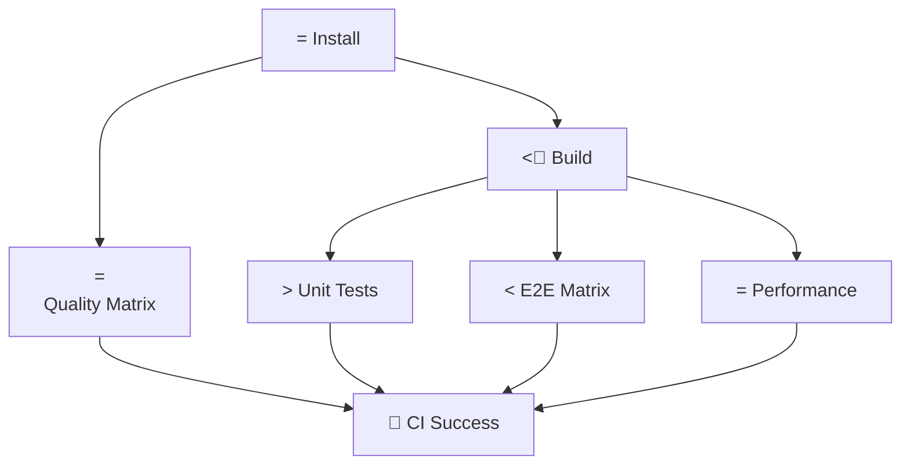

# Pulpe - Infrastructure Guide

_AI Context Document for AIDD/BMAD Workflow_

## Executive Summary

**Infrastructure Purpose**: Modern monorepo development and deployment infrastructure optimized for a single-developer workflow with professional CI/CD practices.

**Core Principles**:

- **Developer Experience First**: Local development mirrors production
- **Automation Over Manual Work**: CI/CD handles quality gates and deployments
- **Cost Optimization**: Leverage free tiers and open-source tooling
- **Simplicity Over Complexity**: KISS and YAGNI principles throughout

**Tech Stack Summary**:

- **Development**: Turborepo + PNPM + Local Supabase
- **CI/CD**: GitHub Actions with intelligent caching
- **Deployment**: Multi-platform (Vercel + Railway + Supabase Cloud)
- **Monitoring**: PostHog analytics + structured logging

## Development Infrastructure

### Local Development Environment

**Core Requirements**:

```bash
# Required tools
Node.js 22.x               # Runtime environment
pnpm 10.12.1+              # Package manager
Bun 1.2.17+                # Backend runtime
Supabase CLI               # Database management
Docker Desktop             # Required for Supabase local
```

**Single Command Setup**:

```bash
# Complete development stack
pnpm dev                   # Orchestrates: shared build  frontend + backend dev servers
```

### Monorepo Architecture (Turborepo + PNPM)

**Package Structure**:

```
pulpe-workspace/
    shared/                # pulpe-shared - API contracts (Zod schemas)
    frontend/              # pulpe-frontend - Angular 21 application
    backend-nest/          # backend-nest - NestJS API with Bun
    ios/                   # PulpeApp - iOS SwiftUI (active development)
    turbo.json             # Build orchestration
    pnpm-workspace.yaml    # Package management
```

**Dependency Graph**:

```
pulpe-shared (ESM package)
     workspace:* dependency
frontend + backend (parallel consumption)
     build outputs
Production artifacts
```

**Key Orchestration Features**:

- **Intelligent Caching**: Rebuild only changed packages
- **Automatic Dependencies**: `shared` builds before consumers
- **Parallel Execution**: Independent tasks run simultaneously
- **Type Safety**: Shared schemas ensure API contract compliance

### Environment Configuration Strategy

**Environment Hierarchy**:

1. **Development**: `.env.local` (local Supabase, ignored by Git)
2. **CI/CD**: `.env.ci` (GitHub Actions with local Supabase)
3. **Production**: Environment variables (Vercel/Railway)

**Configuration Sources**:

- **Backend**: Environment variables `.env` files
- **Frontend**: Dynamic `config.json` generation from `PUBLIC_*` env vars
- **Shared**: No environment dependencies (pure ESM)

**Critical Environment Variables**:

```bash
# Backend (backend-nest/.env)
NODE_ENV=development|test|production
SUPABASE_URL=https://project.supabase.co
SUPABASE_ANON_KEY=eyJ...
SUPABASE_SERVICE_ROLE_KEY=eyJ...

# Frontend (Vercel environment variables)
PUBLIC_SUPABASE_URL=https://project.supabase.co
PUBLIC_SUPABASE_ANON_KEY=eyJ...
PUBLIC_BACKEND_API_URL=https://api.domain.com/api/v1
PUBLIC_ENVIRONMENT=development|production
```

## Build & Orchestration

### Turborepo Configuration

**Core Task Configuration**:

```json
{
  "tasks": {
    "build": {
      "dependsOn": ["^build"],
      "outputs": ["dist/**", ".next/**"],
      "env": ["NODE_ENV"]
    },
    "dev": {
      "cache": false,
      "persistent": true,
      "dependsOn": ["^build"]
    },
    "test": {
      "dependsOn": ["^build"],
      "outputs": ["coverage/**"]
    }
  }
}
```

**Performance Optimizations**:

- **Cache Strategy**: Content-based hashing with filesystem cache
- **Incremental Builds**: Only rebuild changed packages
- **Parallel Tasks**: Independent operations run concurrently
- **Dependency Respect**: Automatic build order enforcement

**Common Commands**:

```bash
# Development workflows
pnpm dev                   # Full stack development
pnpm dev:frontend-only     # Frontend + shared only
pnpm dev:backend-only      # Backend + shared only

# Build operations
pnpm build                 # Production builds with caching
pnpm build --filter=shared # Build specific package
pnpm build --force         # Ignore cache (debug)

# Quality assurance
pnpm quality               # Type-check + lint + format
pnpm quality:fix           # Auto-fix issues
pnpm test                  # All tests with orchestration
```

### Product Versioning Strategy

**Unified Versioning**: All packages share a single product version (SemVer `0.x.y`).

- All packages (frontend, backend, shared, landing) bump together
- One changelog per release, not per package
- GitHub Releases created automatically

**Release Workflow**:

```bash
pnpm update-changelog     # Analyze git changes, bump all packages, update changelogs
```

## CI/CD Pipeline

### GitHub Actions Architecture

**Workflow Strategy**:

- **Matrix Parallelization**: 5 concurrent jobs for maximum efficiency
- **Intelligent Caching**: Multi-level caching (pnpm, Playwright, build artifacts)
- **Security-First**: Minimal permissions, fixed action versions
- **Performance Optimized**: 60-70% faster than sequential workflows

**Job Orchestration**:



**Key Optimizations**:

- **Supabase Local**: Each CI run uses isolated local database
- **Playwright Matrix**: Parallel testing on Chromium, Firefox, WebKit
- **Quality Matrix**: Lint, format, type-check run concurrently
- **Build Artifacts**: Shared between jobs via GitHub Actions artifacts

### CI Performance Metrics

| Optimization     | Implementation                   | Time Savings |
| ---------------- | -------------------------------- | ------------ |
| Parallel Jobs    | 5 concurrent jobs                | 60-70%       |
| PNPM Cache       | Native GitHub Actions cache      | 70-80%       |
| Playwright Cache | Conditional browser installation | 100% on hit  |
| Build Artifacts  | Job-to-job artifact sharing      | 30-40%       |

**Total CI Time**: 5-8 minutes (down from 15-20 minutes)

### Supabase CI Integration

**Local Database Strategy**:

```yaml
# Supabase setup in CI
- uses: supabase/setup-cli@v1
- run: supabase start --exclude studio,inbucket,imgproxy
- run: |
    # Health check with timeout
    until curl -s http://127.0.0.1:54321/rest/v1/; do
      sleep 1
    done
```

**Benefits**:

- **Isolation**: Each PR gets clean database state
- **Cost**: Zero additional infrastructure costs
- **Consistency**: Same local setup as development
- **Performance**: ~2-3 minute Supabase startup

## Deployment Infrastructure

### Multi-Platform Deployment Strategy

**Platform Distribution**:

- **Frontend**: Vercel (Edge Network, Serverless Functions)
- **Backend**: Railway (Containerized Deployment)
- **Database**: Supabase Cloud (PostgreSQL + Auth + RLS)
- **Analytics**: PostHog Cloud (Event Tracking)

### Frontend Deployment (Vercel — Two Projects)

**Architecture**: Two separate Vercel projects from the same monorepo:

| Domain | Project | Framework |
|--------|---------|-----------|
| `pulpe.app` / `www.pulpe.app` | `pulpe-landing` | Next.js |
| `app.pulpe.app` | `pulpe-frontend` | Angular |

**Angular App (`pulpe-frontend`)**:

- **Build**: `pnpm build:shared && turbo build --filter=pulpe-frontend && pnpm --filter=pulpe-frontend upload:sourcemaps`
- **Output**: `frontend/dist/webapp/browser`
- **Config**: Dynamic `config.json` generated from `PUBLIC_*` env vars
- **Preview**: Automatic per PR

**Landing (`pulpe-landing`)**:

- **Root Directory**: `landing`
- **Build**: `cd .. && pnpm build:shared && cd landing && pnpm build`
- **Install**: `cd .. && pnpm install --frozen-lockfile --filter=pulpe-landing --filter=pulpe-shared --ignore-scripts`

**Ignored Build Step** (each project skips when only the other changed):
- Landing: `git diff --quiet HEAD^ HEAD -- landing/ shared/`
- Angular: `git diff --quiet HEAD^ HEAD -- frontend/ shared/`

**Key Environment Variables (Angular App)**:

```env
PUBLIC_SUPABASE_URL=https://project.supabase.co
PUBLIC_SUPABASE_ANON_KEY=eyJ...
PUBLIC_BACKEND_API_URL=https://api.pulpe.app/api/v1
PUBLIC_ENVIRONMENT=production
```

### Backend Deployment (Railway)

**Container Strategy**:

```dockerfile
# Multi-stage build for optimization
FROM oven/bun:slim AS builder
WORKDIR /app
COPY . .
RUN bun install --frozen-lockfile
RUN bun run build

FROM oven/bun:slim AS runtime
WORKDIR /app
COPY --from=builder /app/dist ./dist
COPY --from=builder /app/node_modules ./node_modules
EXPOSE 3000
CMD ["bun", "run", "dist/main.js"]
```

**Deployment Configuration**:

```env
NODE_ENV=production
PORT=3000
RAILWAY_DOCKERFILE_PATH=backend-nest/Dockerfile
CORS_ORIGIN=https://app.pulpe.app
SUPABASE_URL=https://project.supabase.co
SUPABASE_ANON_KEY=eyJ...
```

**Auto-Deployment**:

- **Trigger**: Push to `main` branch
- **Process**: Automatic Docker build deployment health checks
- **Rollback**: Instant rollback on deployment failure

### Database Infrastructure (Supabase)

**Production Architecture**:

- **Region**: EU-Central-1 (GDPR compliance)
- **Backup Strategy**: Automatic daily backups
- **RLS Policies**: User-level data isolation
- **Migration Strategy**: Automated via GitHub Actions

**Migration Workflow**:

```yaml
# Auto-deploy on migration changes
name: = Deploy Supabase Migrations
on:
  push:
    branches: [main]
    paths: ["backend-nest/supabase/migrations/**"]
```

**Security Configuration**:

- **JWT Validation**: Backend validates all requests via Supabase Auth
- **Row Level Security**: Database-enforced user isolation
- **Service Role**: Backend-only operations with elevated permissions

## Environment Management

### Development Environments

**Local Development**:

```bash
# Full local stack
supabase start                # Local PostgreSQL + Auth
pnpm dev:backend             # NestJS on :3000
pnpm dev:frontend            # Angular on :4200
```

**Environment Isolation**:

- **Database**: Isolated Supabase local instance
- **Auth**: Local auth provider with test users
- **Storage**: Local file system
- **Analytics**: Disabled in development

### Configuration Management

**Frontend Config Generation**:

```javascript
// scripts/generate-config.js
const config = {
  supabaseUrl: process.env.PUBLIC_SUPABASE_URL || "http://localhost:54321",
  supabaseAnonKey: process.env.PUBLIC_SUPABASE_ANON_KEY || "local-key",
  backendApiUrl:
    process.env.PUBLIC_BACKEND_API_URL || "http://localhost:3000/api/v1",
  environment: process.env.PUBLIC_ENVIRONMENT || "development",
};
```

**Security Best Practices**:

- **Secrets Management**: GitHub Secrets for sensitive values
- **Public Variables**: Only `PUBLIC_*` prefix exposed to frontend
- **Environment Separation**: Different secrets per environment
- **Rotation**: Regular API key rotation schedule

## Monitoring & Analytics

### PostHog Analytics Integration

**Event Tracking Strategy**:

```typescript
// Core analytics events
posthog.capture("user_action", {
  action: "budget_created",
  user_id: user.id,
  properties: { budget_type: "monthly" },
});
```

**Implementation Details**:

- **Privacy-First**: No PII in events
- **Performance**: Async event capture
- **Error Tracking**: Automatic error capture with context
- **User Journey**: Funnel analysis for onboarding

### Structured Logging (Backend)

**Pino Logger Configuration**:

```typescript
// Structured logging with correlation IDs
logger.info(
  {
    operation: "budget_creation",
    userId: user.id,
    duration: performance.now() - startTime,
    correlationId: req.headers["x-request-id"],
  },
  "Budget created successfully",
);
```

**Log Levels**:

- **Error**: Server errors, business exceptions
- **Warn**: Client errors, validation failures
- **Info**: Business operations, performance metrics
- **Debug**: Technical details (development only)

**Security Features**:

- **PII Redaction**: Automatic sensitive data filtering
- **Request Correlation**: Unique IDs for request tracing
- **Performance Tracking**: Response time monitoring

### Error Handling & Monitoring

**Global Error Strategy**:

```typescript
// Frontend global error handler
@Injectable()
export class GlobalErrorHandler implements ErrorHandler {
  handleError(error: Error): void {
    // Log to PostHog with context
    posthog.capture("error", {
      error_message: error.message,
      stack_trace: error.stack,
      user_agent: navigator.userAgent,
      url: window.location.href,
    });
  }
}
```

**Backend Exception Filter**:

```typescript
@Catch()
export class GlobalExceptionFilter implements ExceptionFilter {
  catch(exception: unknown, host: ArgumentsHost) {
    // Structured error response with correlation
    const response = {
      error: {
        message: "Internal server error",
        code: "INTERNAL_ERROR",
        correlationId: req.headers["x-request-id"],
      },
    };
  }
}
```

## Security & Access Control

### Authentication Flow

**JWT Token Strategy**:

1. **Frontend**: Supabase Auth SDK manages token lifecycle
2. **Backend**: AuthGuard validates tokens via `supabase.auth.getUser()`
3. **Database**: RLS policies enforce user-level data access
4. **API**: Custom decorators inject authenticated user context

**Security Layers**:

```typescript
// Multi-layer security
@Controller("budgets")
@UseGuards(AuthGuard) // JWT validation
export class BudgetController {
  @Get()
  async getBudgets(@User() user: User) {
    // RLS automatically filters by user.id
    return this.budgetService.findByUser(user.id);
  }
}
```

### Row Level Security (RLS)

**Database-Level Security**:

```sql
-- User isolation at database level
ALTER TABLE monthly_budget ENABLE ROW LEVEL SECURITY;

CREATE POLICY "Users can only access their own budgets" ON monthly_budget
    FOR ALL TO authenticated
    USING (auth.uid() = user_id);
```

**Benefits**:

- **Zero Trust**: Database enforces security regardless of application bugs
- **Performance**: Index-optimized security filters
- **Auditability**: Built-in access logging

### Rate Limiting & Anti-Spam Protection

**User-Based Throttling Strategy**:

```typescript
// Custom UserThrottlerGuard tracks by user.id for authenticated requests
@Injectable()
export class UserThrottlerGuard extends ThrottlerGuard {
  protected override generateKey(
    context: ExecutionContext,
    suffix: string,
    name: string,
  ): string {
    const request = context.switchToHttp().getRequest();
    const user = request.user as AuthenticatedUser | undefined;

    // Track by user ID for authenticated requests
    if (user?.id) {
      return `user:${user.id}:${suffix}`;
    }

    // Fall back to IP-based tracking for public endpoints
    return super.generateKey(context, suffix, name);
  }
}
```

**Rate Limit Configuration**:

- **Authenticated Users**: 1000 requests/minute per user (~16 req/sec sustained)
- **Demo Endpoint**: 30 requests/hour per IP (prevents demo abuse)
- **Justification**: Generous for legitimate usage, tight enough to prevent spam/DoS

**Protection Layers**:

```
Layer 1: Rate Limiting by user.id (prevents spam from compromised accounts)
Layer 2: JWT Validation (ensures user identity)
Layer 3: Supabase RLS (ensures data isolation)
Layer 4: CloudFlare Turnstile (bot protection on demo endpoint)
```

**Benefits of User-Based Tracking**:

- **No False Positives**: Same user across VPN/WiFi/devices shares one limit
- **Spam Protection**: Attacker with valid JWT limited to 1000 req/min
- **Independent Limits**: Each user has dedicated rate limit quota
- **Proxy-Safe**: Works behind Railway proxy/load balancer

**Response Headers**:

```http
X-RateLimit-Limit: 1000         # Maximum requests allowed
X-RateLimit-Remaining: 847      # Remaining requests in window
X-RateLimit-Reset: 1698765432   # Unix timestamp of reset
```

### Secrets Management

**GitHub Secrets Strategy**:

```yaml
# Production secrets (encrypted)
SUPABASE_SERVICE_ROLE_KEY    # Database admin access
VERCEL_TOKEN                 # Deployment automation
RAILWAY_TOKEN                # Container deployment

# CI/CD secrets (local development keys)
SUPABASE_LOCAL_URL           # http://127.0.0.1:54321
SUPABASE_LOCAL_ANON_KEY      # Standard local key
```

**Security Best Practices**:

- **Least Privilege**: Minimal required permissions
- **Rotation Schedule**: Quarterly key rotation
- **Environment Separation**: Different keys per environment
- **Audit Trail**: All secret access logged

## Performance & Optimization

### Build Performance

**Turborepo Optimizations**:

- **Content-Based Caching**: Only rebuild on actual changes
- **Remote Caching**: Shared cache between developers (future)
- **Parallel Execution**: CPU-bound tasks utilize all cores
- **Incremental Builds**: Package-level granularity

**Bundle Optimization**:

```typescript
// Angular optimization
export const appConfig: ApplicationConfig = {
  providers: [
    // Tree-shakable imports
    importProvidersFrom(BrowserAnimationsModule),
    // Lazy loading for all features
    provideRouter(routes, withPreloading(PreloadAllModules)),
  ],
};
```

### Runtime Performance

**Frontend Optimizations**:

- **OnPush Change Detection**: 90% reduction in change detection cycles
- **Signal-Based State**: Reactive updates without zone.js overhead
- **Lazy Loading**: All features loaded on demand
- **Bundle Analysis**: Regular analysis with `pnpm analyze`

**Backend Optimizations**:

- **Bun Runtime**: 3x faster than Node.js for I/O operations
- **Connection Pooling**: Supabase handles database connections
- **Response Caching**: HTTP-level caching for static data
- **Request Correlation**: Performance tracking per request

### Database Performance

**Query Optimization**:

- **RLS-Optimized Indexes**: Database indexes consider security filters
- **Connection Pooling**: Managed by Supabase infrastructure
- **Query Analysis**: Automatic slow query detection
- **Migration Strategy**: Performance-tested migrations

## Troubleshooting & Maintenance

### Common Issues & Solutions

**Development Issues**:

```bash
# Turborepo cache issues
pnpm clean                  # Clear all caches
turbo build --force         # Ignore cache

# Supabase connection issues
supabase status             # Check local services
supabase stop && supabase start  # Restart services

# Type sync issues (shared package)
pnpm build --filter=pulpe-shared
# Restart TypeScript in IDE
```

**CI/CD Issues**:

```bash
# GitHub Actions debugging
# Check workflow logs for:
# - Cache hit/miss rates
# - Supabase startup times
# - Test failure patterns
# - Artifact sizes
```

**Deployment Issues**:

```bash
# Vercel deployment
vercel logs <deployment-url>    # Check build logs
vercel env pull                 # Sync environment variables

# Railway deployment
railway logs                    # Container logs
railway status                  # Service health
```

### Monitoring & Alerts

**Health Checks**:

- **Frontend**: Vercel automatic health monitoring
- **Backend**: Railway health endpoint monitoring
- **Database**: Supabase infrastructure monitoring
- **CI/CD**: GitHub Actions status notifications

**Performance Monitoring**:

- **Build Times**: Track Turborepo performance metrics
- **Test Duration**: Monitor test suite performance
- **Deployment Speed**: Track deployment pipeline efficiency
- **Error Rates**: PostHog error tracking and alerting

### Backup & Recovery

**Data Backup Strategy**:

- **Database**: Supabase automatic daily backups + point-in-time recovery
- **Code**: Git repository with branch protection
- **Environment Config**: Infrastructure as Code principles
- **Secrets**: Documented in secure password manager

**Recovery Procedures**:

1. **Database Recovery**: Supabase dashboard restore from backup
2. **Application Recovery**: Git revert + redeploy
3. **Environment Recovery**: Environment variable restoration
4. **Complete Disaster Recovery**: Full project recreation from documentation

---

_This document provides comprehensive infrastructure context for AI-driven development following BMAD methodology principles. It focuses on operational knowledge while complementing other memory-bank documents._
